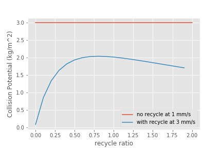

.. _title_Sedimentation_Theory_and_Future_Work:

**************
Future Work
**************
Unsolved sedimentation tank failure modes:

#. :ref:`Floc volcanoes <heading_Floc_Volcanoes>`
#. Dissolved air flotation that results from air coming out of solution. Two sources of air include compressed air traveling from the transmission line and dissolved air released due to increased temperature.
#. Slime growth from iron-oxidizing bacteria.
#. NOM impact on floc density.

.. _heading_Floc_Floc_Blanket:

Flocculator to Floc Blanket Transition
=======================================

We now have a published flocculator model and we have strong evidence that primary particles are removed first order with respect to depth (or time) in the floc blanket. Given these two models it is possible for the first time to optimize the design of a flocculator based on minimizing the volume of the flocculator and floc blanket reactors.

From the floc model we have

.. math::
  :label: dCPdt_floc

	 \frac{dC_{P}}{dt}=-\pi\bar{\alpha}kC_{P}\left(\frac{6}{\pi}\frac{C_{P}}{\rho_P}\right)^{2/3} G_{CS}

From the floc blanket we know that particle removal is first order with respect to depth of the floc blanket or time in the floc blanket. We can use floc blanket data to estimate the first order rate constant.

.. math::
  :label: dCPdt_fb

	 \frac{dC_{P}}{dt}=-k_{fb}C_{P}

Separate variables to integrate this rate equation.

.. math::
  :label:

	 \frac{dC_{P}}{C_{P}}=-k_{fb}dt

We integrate this to solve for the rate constant.

.. math::
  :label:

	 k_{fb} = -\frac{1}{\theta_{fb}}ln{\frac{C_{P}}{C_{P_0}}}

We will use the previous equation to estimate the rate constant for the floc blanket.

We can obtain a minimum volume design by setting the rate of primary particle loss at the end of the flocculator to be equal to the rate of primary particle loss at the beginning of the floc blanket.

.. math::
  :label:

	 -k_{fb}C_{P}=-\pi\bar{\alpha}kC_{P}\left(\frac{6}{\pi}\frac{C_{P}}{\rho_P}\right)^{2/3} G_{CS}

Now we solve the previous equation for the target concentration of primary particles that we should design for at the end of the flocculator.

.. math::
  :label:

	C_{P_{floc out}} = \frac{\pi \rho_P}{6} \left( \frac{k_{fb}}{\pi\bar{\alpha}k G_{CS}}\right)^{3/2}

The concentration of primary particles at the flocculator effluent will be a function of the flocculator velocity gradient.

The next step is to determine the Gt for the flocculator given this effluent flocculator particle concentration. The approximate equation for

.. math::
  :label:

   G_{CS}\theta \approx \frac{3}{2} \frac{\Lambda^2}{k \pi D_P^2 \alpha}

where the particle separation distance is given by

.. math::
  :label:

  \Lambda = \left( \frac{\pi D_P^3}{6} \frac{\rho_P}{C_P} \right)^\frac{1}{3}

Putting the previous two equations together we have:

.. math::
  :label:

   G_{CS}\theta \approx \frac{3}{2} \frac{1}{k \pi D_P^2 \alpha} \left( \frac{\pi D_P^3}{6} \frac{\rho_P}{C_P} \right)^\frac{2}{3}

We can simplify this equation because the particle size cancels out.

.. math::
  :label:

   G_{CS}\theta \approx \frac{3}{2} \frac{1}{k \pi \alpha} \left( \frac{\pi}{6} \frac{\rho_P}{C_P} \right)^\frac{2}{3}

Now we can substitute the equation for the optimal flocculated water primary particle concentrations into the flocculator performance equation.

.. math::
  :label:

   G_{CS}\theta \approx \frac{3}{2} \frac{1}{k \pi \alpha} \left( \frac{\pi\bar{\alpha}k G_{CS}}{k_{fb}}\right)

This simplifies to a very simple relationship that gives the optimal flocculator residence time. This analysis assumes that the cost per volume of flocculator is the same as the cost per volume of floc blanket.

.. math::
  :label:

  \theta \approx \frac{3}{2} \left( \frac{1}{k_{fb}}\right)

We now have an equation for the optimal flocculator residence time! It is a function of the floc blanket rate constant. The analysis below suggests that the optimal flocculator residence time is about 300 seconds (5 minutes). This analysis does not provide guidance on the optimal amount of energy to be used in that flocculator. Overall plant performance is a function of how much energy is used in flocculation and so that would need to be an economic analysis. Startup performance when the floc blanket is not yet formed is a function of the energy dissipation rate.

This analysis suggests that a residence time that is less than what we are currently using for civil works AguaClara plants (about 8 minutes) and greater than what we are using for the PF300 (1-2 minutes) is the optimal solution.
High velocity gradients for flocculators with this long of a residence time will require a lot of head loss. We need to make sure that we are using a reasonable amount of energy.

The flocculator head loss is given by

.. math::
  :label:

   h_{Floc} = G_{CS} \theta \frac{\nu G_{CS}}{g}

`See here for calculations of headloss throuh the floc blanket <https://colab.research.google.com/drive/1lE7cHu3TS1vMs0_yA3FmNdPnk3iktBJw#scrollTo=fMlmtxm_YWJY&line=2&uniqifier=1>`_

The target flocculator Gt of 39,000 is crazy close to the current design. This value will undoubtedly change somewhat as we get better measurements for the floc blanket rate constant.

This analysis suggests that the primary particle concentration after flocculation can be quite high when operating with a floc blanket. Further work will be required to ensure that startup is not a problem.

.. _heading_Floc_recycle:

Floc Recycle
==================

We hypothesize that the flocs in floc blankets serve as collectors that primary particles attach to. We suspect that collisions between primary particles and large flocs are possible in the sedimentation tank because the rotational velocity of the flocs is small relative to the sedimentation velocity of the flocs. If the rotational velocity of the flocs is small, then a stagnation point will exist on the floc and a finite flow of fluid will come within a primary particle radius of the floc. Thus we expect primary particle removal in floc blankets to be proportional to the number of collectors that a primary particle passes while in the floc blanket.

The number of collectors that a primary particle passes is proportional to the solids concentration (a surrogate for the number concentration of flocs), the primary particle residence time in the floc blanket, and the sedimentation velocity of the flocs. The sedimentation velocity of the flocs is important because that is what causes a relative velocity between the primary particles and the flocs.

As we have explored increasing the upflow velocity in sedimentation tanks the performance has dropped markedly. This is undoubtedly due in part to the combined effect of a very dilute floc blanket at high upflow velocities AND a low residence time for the primary particles.

Would it be possible to increase the concentration of the floc blanket and thus increase the collision rate? At 3 mm/s upflow velocity there are very few flocs that can stay in the floc blanket. We need a mechanism to transport flocs to the bottom of the floc blanket and return them again after they are carried to the top of the floc blanket.

We propose to test this by installing a settled floc recycle line. The recycle line will connect to the bottom surface of the tube settler below the location of the floc weir. From there is will carry concentrated sludge to the very bottom of the sedimentation tank where it will pass through the wall of the sedimentation tank. Increasing the amount of recycle flow will both increase the solids concentration in the floc blanket and decrease the primary particle residence time in the floc blanket.

There must be an optimal amount of recycled flocs for a floc blanket. Of course, one possiblity is that the optimal recycle is zero. Recycled flocs increase the floc blanket concentration and thus increase the rate of collisions between primary particles and flocs. The recycled flocs also decrease the residence time in the floc blanket and thus decrease the total number of collisions between primary particles and flocs. It may be more complicated than this because the hindered sedimentation velocity of the flocs in the floc blanket is also a function of their concentration.

Our goal is to find the optimal recycle ratio. Optimal is defined as the maximum collision potential. Collision potential for the floc blanket is proportional to to the collision rate times the hydraulic residence time. The collision rate is proportional to the solids concentration and the hindered sedimentation velocity of those flocs. The collision potential is thus proportional to the total number of flocs that a primary particle passes on its way through the floc blanket.

.. math:: CP_{fb} \propto C_{fb} \theta_{fb} \bar v_{hindered}

The residence time in the floc blanket is given by

.. math:: \theta_{fb} = \frac{H_{fb}}{\bar v_{fb}}

.. math:: \bar v_{fb} = \frac{Q_{plant} + Q_{recycle}}{A_{fb}}

.. math:: Q_{recycle} = \Pi_{recycle}Q_{plant}

The velocity up through the floc blanket without recycle is defined as

.. math:: \bar v_z = \frac{Q_{plant}}{A_{fb}}

.. math:: \bar v_{fb} = \bar v_z\left( 1 + \Pi_{recycle} \right)

Now we need equations for the concentration in the floc blanket. This is based on mass conservation such that the mass in the floc blanket is constant. There is a hindered sedimentation velocity of the flocs that results in a reduction of the mass flux out of the top of the control volume.

.. math:: C_{fb}\left(\frac{ Q_{plant}+Q_{recycle} }{A_{fb}}-\bar v_{hindered}\right) A_{fb}= C_{plant}Q_{plant} + C_{recycle}Q_{recycle}

.. math:: C_{fb}\left(\frac{ Q_{plant}+\Pi_{recycle}Q_{plant} }{A_{fb}}-\bar v_{hindered}\frac{Q_{plant}}{Q_{plant}}\right) A_{fb}= C_{plant}Q_{plant} + C_{recycle}\Pi_{recycle}Q_{plant}

.. math:: C_{fb}\left( 1+\Pi_{recycle} -\frac{\bar v_{hindered}}{\bar v_z}\right) = C_{plant} + C_{recycle}\Pi_{recycle}

.. math:: C_{fb} = \frac{C_{plant} + C_{recycle}\Pi_{recycle}}{\left(1+\Pi_{recycle}-\frac{\bar v_{hindered}}{\bar v_z}\right)}

Now we can substitute to get the collision potential as a function of the flow rates.

.. math:: CP_{fb} \propto \frac{C_{plant} + C_{recycle}\Pi_{recycle}}{\left(1+\Pi_{recycle}-\frac{\bar v_{hindered}}{\bar v_z}\right)\left( 1 + \Pi_{recycle} \right)}  \frac{H_{fb}\bar v_{hindered}} {\bar v_z}

We estimate the hindered sedimentation velocity to be 1 mm/s since that is what occurs in a 1 mm/s upflow velocity floc blanket. Ideally we would have a hindered sedimentation velocity as a function of the concentration of flocs in the floc blanket. The concentration of recycled flocs is assumed to be approximately 20 g/L based on Casey Garland's measurements of the solids concentration in the floc hopper sludge.

`The following plot can be generated here <https://colab.research.google.com/drive/1lE7cHu3TS1vMs0_yA3FmNdPnk3iktBJw#scrollTo=Z53_rxgCYne3&line=4&uniqifier=1>`_

 .. _Collision potential with sludge recycle:

    Collision potential comparison in a 1 m deep floc blanket.

This analysis suggest that a recycle flow rate that is between 0.5 and 1.5 at a net upflow velocity of 3 mm/s could produce collision potential that is 2/3 of the collision potential with a 1 mm/s upflow velocity. Thus a 3 mm/s sed tank with 1.5 m of floc blanket and recycle might be able to perform at the same level as a 1 mm/s sed tank with a 1 m floc blanket.

The next step is to design the recycle tube. The recycle tube could be inclined to promote additional consolidation to reduce the amount of water that is recycled. The slope would need to be about 60 degrees. We could experiment with the design of the recycle line if it were made of flexible tubing.

It is expected that the consolidated sludge will flow by gravity because of its higher density. The big unknown is what diameter recycle line is needed for a lab scale test with a 2.5 cm diameter sedimentation tank.

The recycle sludge has a density given by

.. math:: \rho_{sludge} = \left( 1 - \frac{\rho_{H_2O}}{\rho_{Clay}} \right) C_{sludge} + \rho_{H_2O}

The piezometric head (measured in equivalent change in height of the recycle line liquid) that is causing the flow through the recycle line is equal to the difference in density between the recycled sludge and the floc blanket times the height of the floc blanket normalized by the recycle line density.

.. math:: H_l = H_{fb}\frac{\rho_{sludge} - \rho_{fb}}{\rho_{sludge}}

Substitute to replace the sludge and floc blanket densities.

.. math:: H_l = H_{fb}\frac{\left( 1 - \frac{\rho_{H_2O}}{\rho_{Clay}} \right) C_{sludge} + \rho_{H_2O} -\left[  \left( 1 - \frac{\rho_{H_2O}}{\rho_{Clay}} \right) C_{fb} + \rho_{H_2O} \right]} {\left( 1 - \frac{\rho_{H_2O}}{\rho_{Clay}} \right) C_{sludge} + \rho_{H_2O}}

Simplify the equation for the head loss in the recycle tube.

.. math:: H_l = H_{fb}\frac{ C_{sludge} -C_{fb}} { C_{sludge} + \frac{\rho_{H_2O}\rho_{Clay}}{  \rho_{Clay} -\rho_{H_2O} }}

The recycle tube is assumed to be sloped at 60 degrees from the horizontal to enable further consolidation. The length of the recycle tube is

.. math:: L_{tube} = H_{fb}/sin(60)

We will assume that the dynamic viscosity of the sludge is the same as the dynamic viscosity of water. We will calculate the kinematic viscosity of the sludge by dividing the dynamic viscosity of water by the density of the recycle.

`Now we can solve for the required tube diameter <https://colab.research.google.com/drive/1lE7cHu3TS1vMs0_yA3FmNdPnk3iktBJw#scrollTo=Nft_WjztY5YE&line=5&uniqifier=1>`_

The head loss in the recycle tube is approximately 1.6 cm in a 1.5 m deep floc blanket.

The recycle line will be installed between the bottom of the tube settler and the inlet to the sedimentation tank. The recycle line will connect  directly to the side of the sedimentation tank to minimize minor losses. We will use a 0.25" ID, 3/8" OD clear flexible tube for the recycle line. We will use PVC glue to attach the flexible tube to the rigid clear PVC tubing.

It is possible that it will be necessary to prevent flow in the recycle line initially so that it doesn't flow upward. Once the tube begins filling with solids it should be possible for it to start flowing downwards.

.. _heading_Floc_Volcanoes:

Floc Volcanoes
==================

Floc volcanoes are caused by differences in temperature between the water that is in a sedimentation tank and the incoming water. If the incoming water is warmer than the water that is already in the sedimentation tank, then the incoming water will be buoyant and will rise quickly to the top of the sedimentation tank and carry flocs to the effluent launder.

Temperature fluctuations can be especially pronounced with small scale water supplies where small streams and small diameter transmission lines can be exposed to the sun and can warm up dramatically during a few hours of sunshine. Given that temperature changes and density changes can not easily be engineered, the only solution that we have is to reduce the time that water spends in the sedimentation tank so that the influent water is closer to the average temperature of the water in the sedimentation tank. Solar heating causing the raw water temperature to go from a minimum at 6 am to a maximum at 1 pm. AguaClara sedimentation tanks currently have a residence time of approximately 2 m / (1 mm/s) or 2000 s. We anticipate that by increasing the upflow velocity and by introducing floc recycle that the effects of temperature induced floc volcanoes will be reduced.
