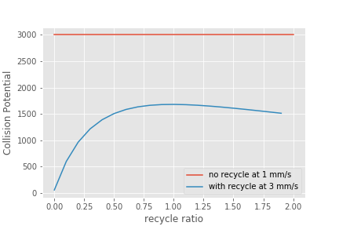

Sedimentation Theory and Future Work
=====================================

We hypothesize that the flocs in floc blankets serve as collectors that primary particles attach to. We suspect that collisions between primary particles and large flocs are possible in the sedimentation tank because the rotational velocity of the flocs is small relative to the sedimentation velocity of the flocs. If the rotational velocity of the flocs is small, then a stagnation point will exist on the floc and a finite flow of fluid will come within a primary particle radius of the floc. Thus we expect primary particle removal in floc blankets to be proportional to the number of collectors that a primary particle passes while in the floc blanket.

The number of collectors that a primary particle passes is proportional to the solids concentration (a surrogate for the number concentration of flocs), the primary particle residence time in the floc blanket, and the sedimentation velocity of the flocs. The sedimentation velocity of the flocs is important because that is what causes a relative velocity between the primary particles and the flocs.

As we have explored increasing the upflow velocity in sedimentation tanks the performance has dropped markedly. This is undoubtedly due in part to the combined effective of a very dilute floc blanket at high upflow velocities AND a low residence time for the primary particles.

Would it be possible to increase the concentration of the floc blanket and thus increase the collision rate? At 3 mm/s upflow velocity there are very few flocs that can stay in the floc blanket. We need a mechanism to transport flocs to the bottom of the floc blanket and return them again after they are carried to the top of the floc blanket.

We propose to test this by installing a settled floc recycle line. The recycle line will connect to the bottom surface of the tube settler below the location of the floc weir. From there is will carry concentrated sludge to the very bottom of the sedimentation tank where it will pass through the wall of the sedimentation tank. Increasing the amount of recycle flow will both increase the solids concentration in the floc blanket and decrease the primary particle residence time in the floc blanket.

There must be an optimal amount of recycled flocs for a floc blanket. Of course, one possiblity is that the optimal recycle is zero. Recycled flocs increase the floc blanket concentration and thus increase the rate of collisions between primary particles and flocs. The recycled flocs also decrease the residence time in the floc blanket and thus decrease the total number of collisions between primary particles and flocs. It may be more complicated than this because the hindered sedimentation velocity of the flocs in the floc blanket is also a function of their concentration.

Our goal is to find the optimal recycle ratio. Optimal is defined as the maximum collision potential. Collision potential for the floc blanket is proportional to to the collision rate times the hydraulic residence time. The collision rate is proportional to the solids concentration and the hindered sedimentation velocity of those flocs. The collision potential is thus proportional to the total number of flocs that a primary particle passes on its way through the floc blanket.

.. math:: CP_{fb} \propto C_{fb} \theta_{fb} v_{hindered}

The residence time in the floc blanket is given by

.. math:: \theta_{fb} = \frac{H_{fb}}{v_{fb}}

.. math:: v_{fb} = \frac{Q_{plant} + Q_{recycle}}{A_{fb}}

.. math:: Q_{recycle} = \Pi_{recycle}Q_{plant}

The velocity up through the floc blanket without recycle is defined as

.. math:: v_{up} = \frac{Q_{plant}}{A_{fb}}

.. math:: v_{fb} = v_{up}\left( 1 + \Pi_{recycle} \right)

Now we need equations for the concentration in the floc blanket. This is based on mass conservation such that the mass in the floc blanket is constant. There is a hindered sedimentation velocity of the flocs that results in a reduction of the mass flux out of the top of the control volume.

.. math:: C_{fb}\left(\frac{ Q_{plant}+Q_{recycle} }{A_{fb}}-v_{hindered}\right) A_{fb}= C_{plant}Q_{plant} + C_{recycle}Q_{recycle}

.. math:: C_{fb}\left(\frac{ Q_{plant}+\Pi_{recycle}Q_{plant} }{A_{fb}}-v_{hindered}\frac{Q_{plant}}{Q_{plant}}\right) A_{fb}= C_{plant}Q_{plant} + C_{recycle}\Pi_{recycle}Q_{plant}

.. math:: C_{fb}\left( 1+\Pi_{recycle} -\frac{v_{hindered}}{v_{up}}\right) = C_{plant} + C_{recycle}\Pi_{recycle}

.. math:: C_{fb} = \frac{C_{plant} + C_{recycle}\Pi_{recycle}}{\left(1+\Pi_{recycle}-\frac{v_{hindered}}{v_{up}}\right)}

Now we can substitute to get the collision potential as a function of the flow rates.

.. math:: CP_{fb} \propto \frac{C_{plant} + C_{recycle}\Pi_{recycle}}{\left(1+\Pi_{recycle}-\frac{v_{hindered}}{v_{up}}\right)\left( 1 + \Pi_{recycle} \right)}  \frac{H_{fb}v_{hindered}} {v_{up}}

We estimate the hindered sedimentation velocity to be 1 mm/s since that is what occurs in a 1 mm/s upflow velocity floc blanket. Ideally we would have a hindered sedimentation velocity as a function of the concentration of flocs in the floc blanket. The concentration of recycled flocs is assumed to be approximately 20 g/L based on Casey Garland measurements of the solids concentration in the floc hopper sludge.

.. code:: python

 from aide_design.play import*
 D_fb=2.5*u.cm
 A_fb = pc.area_circle(D_fb)
 H_fb = 1 * u.m
 v_hindered = 1 * u.mm/u.s
 C_fb_conventional = 3 * u.g/u.L
 C_recycle = 20 * u.g/u.L
 C_plant = 100 * u.NTU
 v_up = 3 * u.mm/u.s

 def CP(H_fb,v_up,v_hindered,Pi_recycle,C_plant,C_recycle):
   return (H_fb*v_hindered/v_up*(C_plant+C_recycle*Pi_recycle)/((1+Pi_recycle)*(1+Pi_recycle-v_hindered/v_up))).to_base_units()
 Pi_recycle_max = 2
 Pi_recycle = np.arange(0,Pi_recycle_max,0.1)
 fig, ax = plt.subplots()
 x=np.array([0,Pi_recycle_max])
 yscale = (C_fb_conventional*H_fb*v_hindered/(1*u.mm/u.s)).to_base_units()
 yscale
 y=np.array([1,1])*yscale
 ax.plot(x,y)
 ax.plot(Pi_recycle,CP(H_fb,v_up,v_hindered,Pi_recycle,C_plant,C_recycle))
 imagepath = 'Sedimentation/Images/'
 ax.set(xlabel='recycle ratio', ylabel='Collision Potential (kg/m^2)')
 ax.legend(["no recycle at 1 mm/s","with recycle at 3 mm/s"])
 fig.savefig(imagepath+'fb_recycle_ratio')
 plt.show()

Here are the results.

 .. _Collision potential with sludge recycle:

    Collision potential comparison in a 1 m deep floc blanket.

This analysis suggest that a recycle flow rate that is between 0.5 and 1.5 at a net upflow velocity of 3 mm/s could produce collision potential that is 2/3 of the collision potential with a 1 mm/s upflow velocity. Thus a 3 mm/s sed tank with 1.5 m of floc blanket and recycle might be able to perform at the same level as a 1 mm/s sed tank with a 1 m floc blanket.

The next step is to design the recycle tube. The recycle tube could be inclined to promote additional consolidation to reduce the amount of water that is recycled. The slope would need to be about 60 degrees. We could experiment with the design of the recycle line if it were made of flexible tubing.

It is expected that the consolidated sludge will flow by gravity because of its higher density. The big unknown is what diameter recycle line is needed for a lab scale test with a 2.5 cm diameter sedimentation tank.

The recycle sludge has a density given by

.. math:: \rho_{sludge} = \left( 1 - \frac{\rho_{H_2O}}{\rho_{Clay}} \right) C_{sludge} + \rho_{H_2O}

The piezometric head (measured in equivalent change in height of the recycle line liquid) that is causing the flow through the recycle line is equal to the difference in density between the recycled sludge and the floc blanket times the height of the floc blanket normalized by the recycle line density.

.. math:: H_l = H_{fb}\frac{\rho_{sludge} - \rho_{fb}}{\rho_{sludge}}

Substitute to replace the sludge and floc blanket densities.

.. math:: H_l = H_{fb}\frac{\left( 1 - \frac{\rho_{H_2O}}{\rho_{Clay}} \right) C_{sludge} + \rho_{H_2O} -\left[  \left( 1 - \frac{\rho_{H_2O}}{\rho_{Clay}} \right) C_{fb} + \rho_{H_2O} \right]} {\left( 1 - \frac{\rho_{H_2O}}{\rho_{Clay}} \right) C_{sludge} + \rho_{H_2O}}

Simplify the equation for the head loss in the recycle tube.

.. math:: H_l = H_{fb}\frac{ C_{sludge} -C_{fb}} { C_{sludge} + \frac{\rho_{H_2O}\rho_{Clay}}{  \rho_{Clay} -\rho_{H_2O} }}

The recycle tube is assumed to be sloped at 60 degrees from the horizontal to enable further consolidation. The length of the recycle tube is

.. math:: L_{tube} = H_{fb}/sin(60)

We will assume that the dynamic viscosity of the sludge is the same as the dynamic viscosity of water. We will calculate the kinematic viscosity of the sludge by dividing the dynamic viscosity of water by the density of the recycle.

Now we can solve for the required tube diameter

.. code:: python

 from aide_design.play import*
 Temperature= 20*u.degC
 D_fb=2.5*u.cm
 A_fb = pc.area_circle(D_fb)
 H_fb = 1.5 * u.m
 Angle_tube = 60*u.deg
 L_tube = H_fb/np.sin(Angle_tube)
 density_clay=2650*u.kg/u.m**3

 H_l = H_fb*(C_recycle-C_fb)/(C_recycle+((pc.density_water(Temperature)*density_clay)/(density_clay-pc.density_water(Temperature))))
 H_l
 Q_plant=v_up*A_fb
 Pi_recycle=0.5
 density_recycle = (1 - pc.density_water(Temperature)/density_clay)*C_recycle + pc.density_water(Temperature)
 nu_recycle = pc.viscosity_dynamic(Temperature)/density_recycle
 D_recycle = pc.diam_pipe(Q_plant*Pi_recycle,H_l,L_tube,nu_recycle,0.01*u.mm,2)
 D_recycle.to(u.mm)
 D_recycle.to(u.inch)

The head loss in the recycle tube is approximately 1.6 cm in a 1.5 m deep floc blanket.

The recycle line will be installed between the bottom of the tube settler and the inlet to the sedimentation tank. The recycle line will connect  directly to the side of the sedimentation tank to minimize minor losses. We will use a 0.25" ID, 3/8"OD clear flexible tube for the recycle line. We will use PVC glue to attach the flexible tube to the rigid clear PVC tubing.

It is possible that it will be necessary to prevent flow in the recycle line initially so that it doesn't flow upward. Once the tube begins filling with solids it should be possible for it to start flowing downwards.
