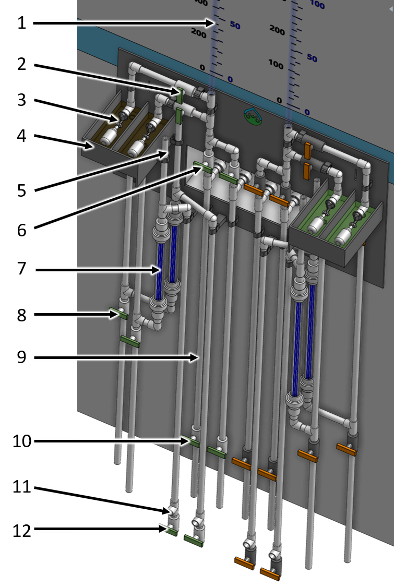

.. _title_Chemical_Dosing:

*************************
Chemical Dosing
*************************

Purpose and Description
=======================

The coagulation and disinfection processes require the precise dosage of coagulant to the plant influent and calcium hypochlorite to the plant effluent. To carry out this process without pumps, the AguaClara plant uses a hydraulic dosing system.

The main components of the system are:

* Tanks to store the coagulant and chlorine stock solutions
* An elevated platform to support the chemical storage tanks at the correct elevation for gravity powered dosing
* A flow measurement cylinder for each chemical
* A pair of constant level tank with float valves that maintains a constant level for both chemical solutions
* Two dosing tube modules that provides the necessary relationship between pressure drop and chemical flow rates for both chemical solutions
* A balance that connects the water level in the plant's entrance tank to the level at the outlet of the chemical dosing system

This system has the characteristic of maintaining a constant chemical **dosage** even as the flow rate through the plant varies. This enables an experienced operator to vary the chemical dosage directly, without doing any calculations, and without having to manipulate the system every time the flow rate in the plant changes. The AguaClara dosing system provides the added benefit of automatically turning off the chemical flow when there is no flow in the plant. This provides security against contamination with excess chemicals and chemical waste in the event that the plant is shut down inadvertently as may occur if the transmission line is damaged.

.. _figure_clt_overview:

.. figure:: Images/clt_overview.png
    :width: 400px
    :align: center
    :alt: constant level tank overview

    Overview of the constant level tank module mounted on the side of the chemical stock tank platform.

.. _table_clt_overview:

.. csv-table:: Constant level tanks Overview
   :header: "Parameter", "value"
   :align: left
   :widths: 10 90

   A, chlorine stock tank volume and flow calibration column sight tube
   B, constant level tank
   C, dosing tube module

General Specifications
======================

.. _table_Chemical_Dosing_General_Specifications:

.. csv-table:: Chemical Dosing General Specifications
   :header: "Parameter", "value"
   :align: left
   :widths: 50 50

   Plant maximum flow rate,  :sub:`($..Qm_max) no-sub`
   Coagulant stock concentration, :sub:`($..chemPipes.coagStockC) no-sub`
   Coagulant maximum dose, :sub:`($..chemPipes.coagDoseCm_max) no-sub`
   Coagulant maximum flow rate, :sub:`($..chemPipes.coagQu_max) no-sub`
   Chlorine stock concentration, :sub:`($..chemPipes.chlorineStockC) no-sub`
   Chlorine maximum dose, :sub:`($..chemPipes.chlorineDoseCm_max) no-sub`
   Chlorine maximum flow rate, :sub:`($..chemPipes.chlorineQu_max) no-sub`
   Maximum head loss thru doser tubes, :sub:`($..doserTubes.HL_max) no-sub`
   

The constant level tank system provides convenient central controls for  

add modularity, redundancy, 

Constant Level Tanks
====================

The constant level tanks prevent the changing chemical levels in the stock tanks from influencing the flow rate thru the dosing system. Float valves maintain a relatively constant level of chlorine and coagulant. The float valves are sized to provide up to the maximum chemical flow rate of :sub:`($..chemPipes.chemQu_max) no-sub` given the minimum head provided by stock tanks (:sub:`($..floatvalveHL_bod) no-sub`).

.. _figure_clt_details:

    Cross-section of an entrance tank. Chemical dosing system not shown.

.. _table_clt_details:

.. csv-table:: Constant level tank module details
   :header: "Parameter", "value"
   :align: left
   :widths: 10 90

   A, coagulant stock tank volume and flow calibration column sight tube
   B, valve to select constant level tank and dosing tube set
   C, float valve to provide constant level of coagulant
   D, constant level tank
   E, air vent to discharge bubbles from dosing tubes
   F, valve to select which stock tank to use
   G, dosing tubes to provide linear relationship between chemical flow rate and head loss
   H, valve to drain constant level tank (for cleaning with vinegar)
   I, sediment trap to capture particles from the stock tank
   J, valve to purge the sediment trap
   K, connection to feed line to the doser
   L, valve to drain the line going to the doser (for cleaning with vinegar)

.. _table_Constant_Level_Tank_Specifications:

.. csv-table:: Constant level tank specifications
   :header: "Parameter", "value"
   :align: left
   :widths: 50 50

   Minimum head provided by stock tanks,  :sub:`($..floatvalveHL_bod) no-sub`
   Maximum head loss through the float valve orifice,  :sub:`($..floatValve.HL_max) no-sub`
   Float valve orifice diameter, :sub:`($..floatValve.orificeD) no-sub`
   Tank inner length, :sub:`($..clt.tankL) no-sub`
   Tank inner width, :sub:`($..clt.tankW) no-sub`
   Tank depth, :sub:`($..clt.tankH) no-sub`
   Tank fluid depth, :sub:`($..clt.tankHW) no-sub`

Dosing Tubes
============

Dosing tubes use laminar flow in a long straight small diameter tube to establish a linear relationship between head loss and flow rate. The velocity in the tubes is limited to ensure that minor losses that scale with velocity squared remain less than :sub:`($..doserTubes.minorHL_pi) no-sub` of the maximum head loss, :sub:`($..doserTubes.HL_max) no-sub`, is from minor losses. 

The number of dosing tubes is increased as needed to ensure that the maximum allowable tube velocity is not exceeded. The dosing tubes are mounted in a module 

.. _figure_dosing_tube_module:

.. figure:: Images/dosing_tube_module.png
    :width: 300px
    :align: center
    :alt: constant level tank details

    Cross-section of an entrance tank. Chemical dosing system not shown.

.. _table_dosing_tube_module:

.. csv-table:: Dosing tube module details
   :header: "Parameter", "value"
   :align: left
   :widths: 10 90

   A, reducer
   B, union
   C, part of union that is glued to the pipe shield and disk
   D, dosing tubes
   E, pipe shield that maintains the dosing tubes in tension 
   F, PVC disk that is glued to the union and that has slightly undersized holes for the dosing tubes
   G, isometric view of the union showing that the dosing tubes are visible above the disk

.. _table_Coagulant_Dosing_Tube_Specifications:

.. csv-table:: Coagulant dosing tube specifications
   :header: "Parameter", "value"
   :align: left
   :widths: 50 50

   Number of tubes per module,  :sub:`($..coagDoserTube.N) no-sub`
   Tube inner diameter, :sub:`($..coagDoserTube.tube.ID) no-sub`
   Tube outer diameter, :sub:`($..coagDoserTube.tube.OD) no-sub`
   Tube length, :sub:`($..coagDoserTube.tube.L) no-sub`
   Pipe guard length, :sub:`($..coagDoserTube.shell.pipe.L) no-sub`
  

.. _table_Chlorine_Dosing_Tube_Specifications:

.. csv-table:: Chlorine dosing tube specifications
   :header: "Parameter", "value"
   :align: left
   :widths: 50 50

   Number of tubes per module,  :sub:`($..chlorineDoserTube.N) no-sub`
   Tube inner diameter, :sub:`($..chlorineDoserTube.tube.ID) no-sub`
   Tube outer diameter, :sub:`($..chlorineDoserTube.tube.OD) no-sub`
   Tube length, :sub:`($..chlorineDoserTube.tube.L) no-sub`
   Pipe guard length, :sub:`($..chlorineDoserTube.shell.pipe.L) no-sub`
  

Doser
=====

Injection Points
================
