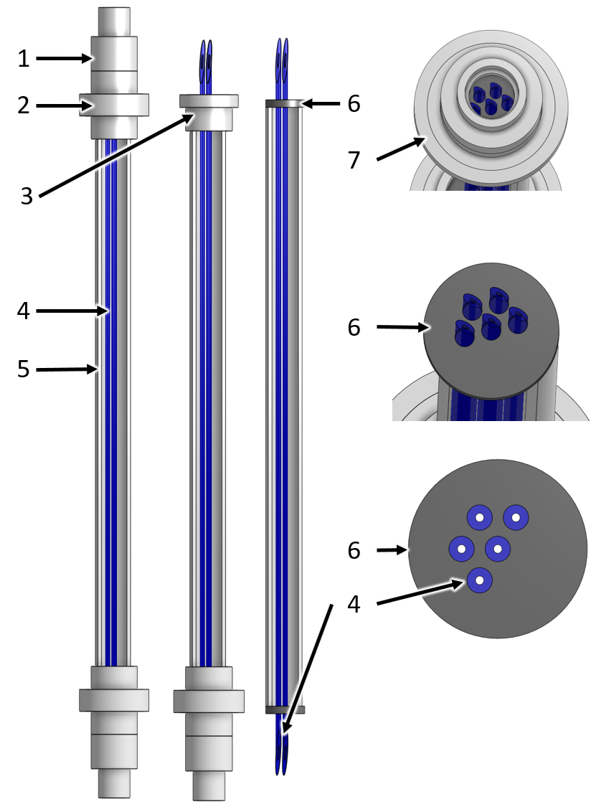

.. _title_Chemical_Dosing:

*************************
Chemical Dosing
*************************

.. add design information from textbook where it exists 

General
-------

Purpose and Description
^^^^^^^^^^^^^^^^^^^^^^^

The coagulation and disinfection processes require the precise dosage of coagulant to the plant influent and calcium hypochlorite to the plant effluent. To carry out this process without pumps, the AguaClara plant uses a hydraulic dosing system.

The main components of the system are:

* Tanks to store the coagulant and chlorine stock solutions
* An elevated platform to support the chemical storage tanks at the correct elevation for gravity powered dosing
* A flow measurement calibration column for each chemical
* A pair of constant level tanks (CLTs) with float valves that maintain a constant level for both chemical solutions
* Two dosing tube modules that provide the necessary relationship between pressure drop and chemical flow rates for each chemical
* A chemical doser (the balance) that connects the water level in the plant's entrance tank to the level at the outlet of the chemical dosing system

This system has the characteristic of maintaining a constant chemical **dosage** even as the flow rate through the plant varies. The plant operator can vary the chemical dosage directly, without doing any calculations, and without having to manipulate the system every time the flow rate in the plant changes. The AguaClara dosing system provides the added benefit of automatically turning off the chemical flow when there is no flow in the plant. This provides security against contamination with excess chemicals and chemical waste in the event that the plant is shut down inadvertently as may occur if the transmission line is damaged.

Chemical Flow Path
^^^^^^^^^^^^^^^^^^
The chemicals are prepared and stored in the chemical stock tanks, on the chemical platform. They then flow from the tanks via piping underneath the platform to the constant level tank system, located against the chemical platform wall. The chemicals flow from the constant level tank system through the dosing tubes to pipes attached to the doser. From there, piping or tubing connects the chemicals to their injection points, where the chemicals are injected into the water in the plant.
.. monroe to review
.. may need a photo for this

Specifications
^^^^^^^^^^^^^^
.. _table_Chemical_Dosing_General_Specifications:
.. csv-table:: Chemical Dosing General Specifications
   :header: "Parameter", "Value"
   :align: left
   :widths: 70 30
   :class: wraptable

   Plant maximum flow rate,  :sub:`($..et.lfom.Qm_max) no-sub`
   Maximum head loss thru doser tubes, :sub:`($..doserTubes.HL_max) no-sub`
   Coagulant stock concentration, :sub:`($..chemPipes.coagStockC) no-sub`
   Coagulant maximum dose, :sub:`($..chemPipes.coagDoseCm_max) no-sub`
   Coagulant maximum flow rate, :sub:`($..chemPipes.coagQu_max) no-sub`
   Chlorine stock concentration, :sub:`($..chemPipes.chlorineStockC) no-sub`
   Chlorine maximum dose, :sub:`($..chemPipes.chlorineDoseCm_max) no-sub`
   Chlorine maximum flow rate, :sub:`($..chemPipes.chlorineQu_max) no-sub`

Chemical Stock Tanks
--------------------
Purpose and Description
^^^^^^^^^^^^^^^^^^^^^^^
Pending.

Specifications
^^^^^^^^^^^^^^
Pending.

Constant Level Tanks
--------------------

Purpose and Description
^^^^^^^^^^^^^^^^^^^^^^^
The constant level tank (CLT) system provides convenient central controls for selection of stock tank, flow calibration, purging sediment, and selection of which of the duplicate chemical feed systems to use. The system has built in redundancy with duplicate systems for dosing each chemical to facilitate routine cleaning and maintenance. The dosing system controls are centralized around the constant level tanks (see :numref:`figure_clt_overview`).

.. _figure_clt_overview:

.. figure:: Images/clt_overview.png
    :width: 400px
    :align: center
    :alt: constant level tank overview

    Overview of the constant level tank module mounted on the side of the chemical stock tank platform.

.. csv-table:: CLT Overview Figure Key
   :header: "Key", "Description"
   :align: left
   :widths: 20 80
   :class: wraptable

   "1", "Chlorine stock tank volume and flow calibration column sight tube"
   "2", "Constant level tank"
   "3", "Dosing tube module"

The constant level tanks prevent the changing chemical levels in the stock tanks from influencing the flow rate through the dosing system. Float valves maintain a relatively constant level of chlorine and coagulant. The float valves are sized to provide up to the maximum chemical flow rate of :sub:`($..chemPipes.chemQu_max) no-sub` given the minimum head provided by stock tanks (:sub:`($..floatvalveHL_bod) no-sub`).

.. _figure_clt_details:

.. figure:: Images/clt_details.png
    :width: 300px
    :align: center
    :alt: constant level tank details

    Constant level tank with associated valves and dosing tubes. The valves with orange handles are compatible with chlorine and have chlorine resistant o'rings.
    .. add something about soda ash here as well

.. csv-table:: CLT Details Figure Key
   :header: "Key", "Description"
   :align: left
   :widths: 20 80
   :class: wraptable

   "1", "Coagulant stock tank volume and flow calibration column sight tube"
   "2", "Valve to select constant level tank and dosing tube set"
   "3", "Float valve to provide constant level of coagulant"
   "4", "Constant level tank"
   "5", "Air vent to discharge bubbles from dosing tubes"
   "6", "Valve to select which stock tank to use"
   "7", "Dosing tubes to provide linear relationship between chemical flow rate and head loss"
   "8", "Valve to drain constant level tank (for cleaning with vinegar)"
   "9", "Sediment trap to capture particles from the stock tank"
   "10", "Valve to purge the sediment trap"
   "11", "Connection to feed line to the doser"
   "12", "Valve to drain the line going to the doser (for cleaning with vinegar)"

There is a pair of constant level tanks for each chemical feed. The specifications for each tank is given in :numref:`table_Constant_Level_Tank_Specifications`.

Specifications
^^^^^^^^^^^^^^
.. _table_Constant_Level_Tank_Specifications:

.. csv-table:: Constant level tank specifications
   :header: "Parameter", "Value"
   :align: left
   :widths: 50 50
   :class: wraptable

   Minimum head provided by stock tanks,  :sub:`($..floatvalveHL_bod) no-sub`
   Maximum head loss through the float valve orifice,  :sub:`($..floatValve.HL_max) no-sub`
   Float valve orifice diameter, :sub:`($..floatValve.orificeD) no-sub`
   Tank inner length, :sub:`($..clt.tankL) no-sub`
   Tank inner width, :sub:`($..clt.tankW) no-sub`
   Tank depth, :sub:`($..clt.tankH) no-sub`
   Tank fluid depth, :sub:`($..clt.tankHW) no-sub`

Dosing Tubes
------------

Purpose and Description
^^^^^^^^^^^^^^^^^^^^^^^
Dosing tubes use laminar flow in a long straight small diameter tube to establish a linear relationship between head loss and flow rate. The velocity in the tubes is limited to ensure that minor losses that scale with velocity squared remain less than :sub:`($..doserTubes.minorHL_pi) no-sub` of the maximum head loss, :sub:`($..doserTubes.HL_max) no-sub`, is from minor losses. 

The number of dosing tubes is increased as needed to ensure that the maximum allowable tube velocity is not exceeded. The dosing tubes are mounted in a module 
.. was there more to this story?

.. _figure_dosing_tube_module:

    The dosing tubes are assembled in a module to facilitate cleaning and replacement.

.. csv-table:: Dosing Tubes Figure Key
   :header: "Key", "Description"
   :align: left
   :widths: 20 80
   :class: wraptable

   "1", "Reducer"
   "2", "Union"
   "3", "Part of union that is glued to the pipe shield and disk"
   "4", "Dosing tubes"
   "5", "Pipe shield that maintains the dosing tubes in tension"
   "6", "PVC disk that is glued to the union and that has slightly undersized holes for the dosing tubes"
   "7", "Isometric view of the union showing that the dosing tubes are visible above the disk"

Specifications
^^^^^^^^^^^^^^^
The coagulant dosing tube specifications are given below.

.. _table_Coagulant_Dosing_Tube_Specifications:

.. csv-table:: Coagulant dosing tube specifications
   :header: "Parameter", "Value"
   :align: left
   :widths: 50 50
   :class: wraptable

   Number of tubes per module,  :sub:`($..coagDoserTube.N) no-sub`
   Tube inner diameter, :sub:`($..coagDoserTube.tube.ID) no-sub`
   Tube outer diameter, :sub:`($..coagDoserTube.tube.OD) no-sub`
   Tube length, :sub:`($..coagDoserTube.tube.L) no-sub`
   Pipe guard length, :sub:`($..coagDoserTube.shell.pipe.L) no-sub`
  
The chlorine dosing tube specifications are given below.

.. _table_Chlorine_Dosing_Tube_Specifications:

.. csv-table:: Chlorine dosing tube specifications
   :header: "Parameter", "Value"
   :align: left
   :widths: 50 50
   :class: wraptable

   Number of tubes per module,  :sub:`($..chlorineDoserTube.N) no-sub`
   Tube inner diameter, :sub:`($..chlorineDoserTube.tube.ID) no-sub`
   Tube outer diameter, :sub:`($..chlorineDoserTube.tube.OD) no-sub`
   Tube length, :sub:`($..chlorineDoserTube.tube.L) no-sub`
   Pipe guard length, :sub:`($..chlorineDoserTube.shell.pipe.L) no-sub`
  

Doser
-----

Pending.

Injection Points
-----------------

Pending.
