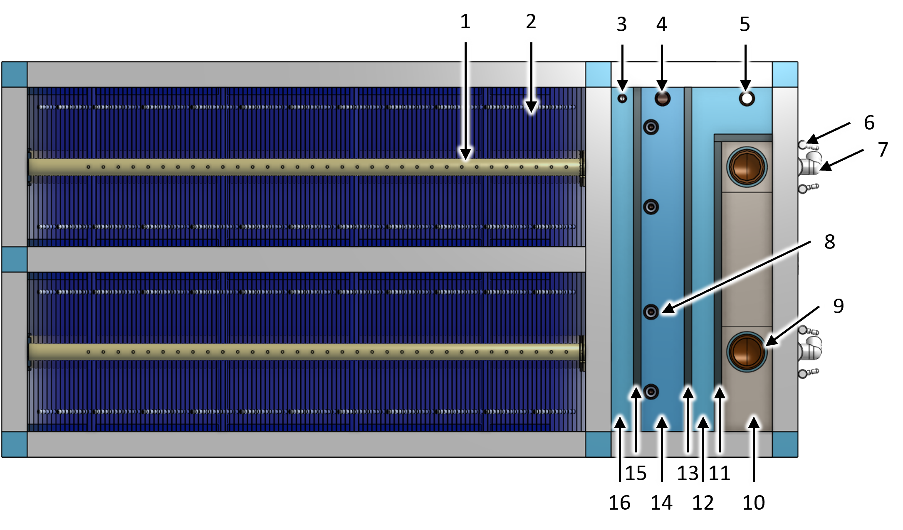
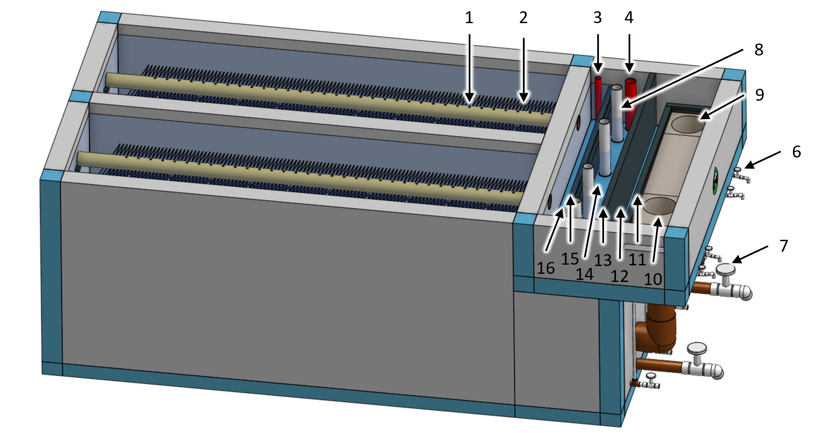
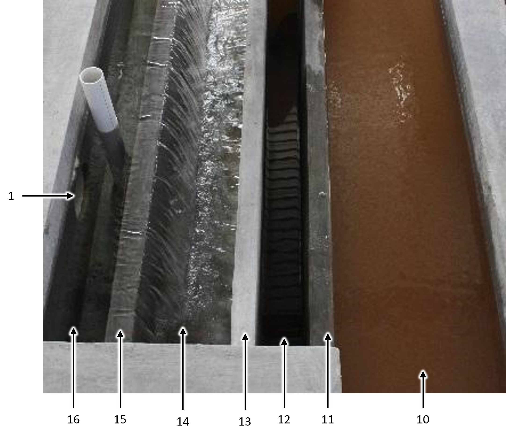
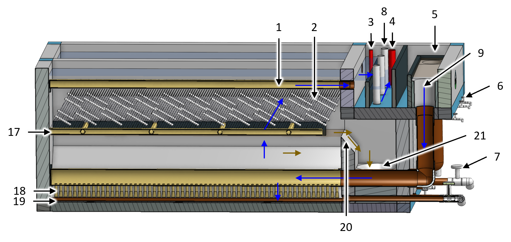
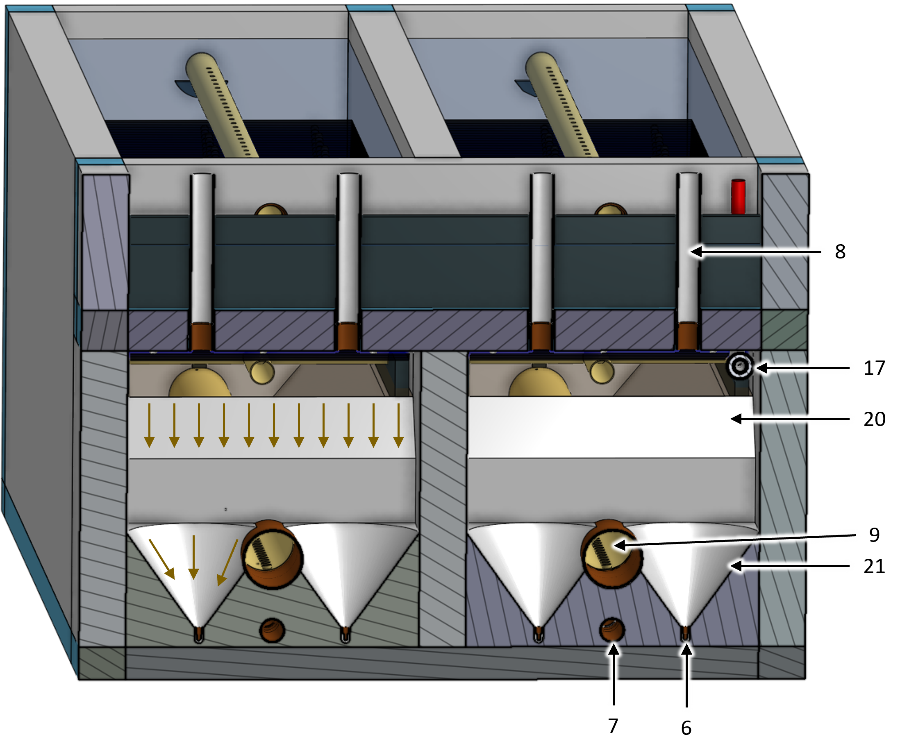
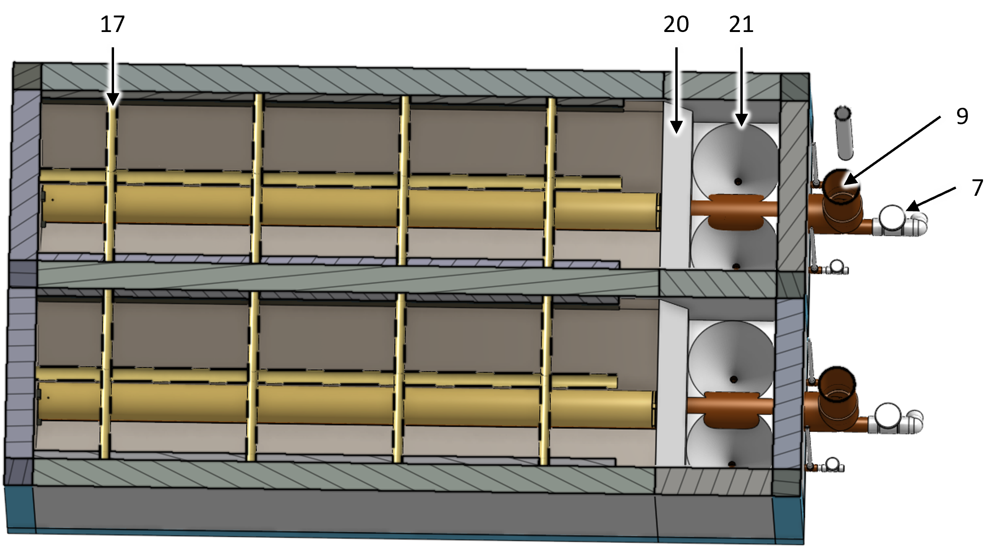
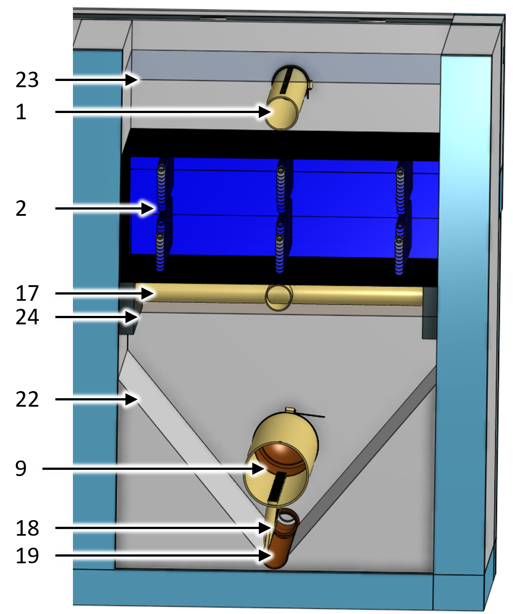
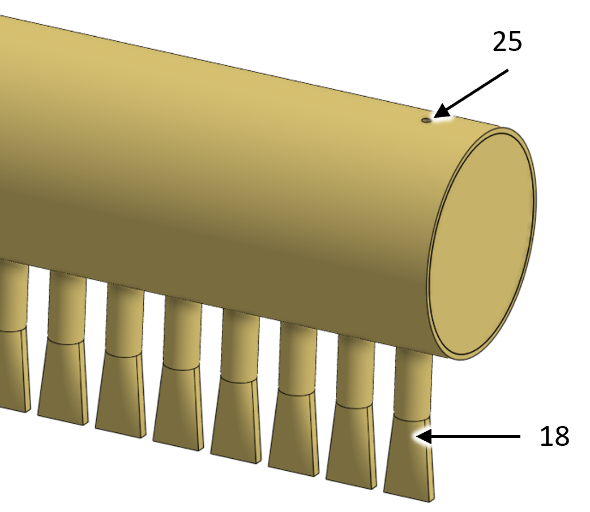
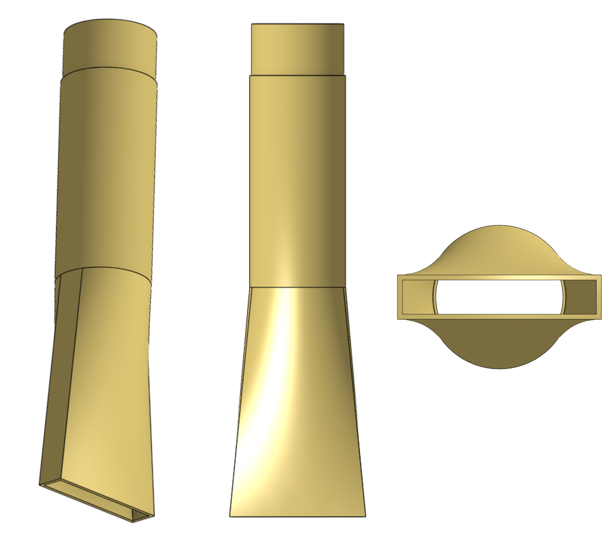

.. _title_Clarifier:

*********
Clarifier
*********

Design information for the AguaClara clarifier is available in `the Clarifier Design chapter of The Physics of Water Treatment Design <https://aguaclara.github.io/Textbook/Clarification/Clarifier_Design.html>`_

Purpose and Description
=======================

The clarifier removes the majority of the particles and pathogens from the raw water source using two distinct mechanisms. 

#. Floc filter - Flocs that form a fluidized bed in the lower part of the clarifier are able to capture small particles as water flows through the porous flocs. 
#. Plate settlers -  Particles with a terminal velocity greater than the plate settler capture velocity (:sub:`($..clarifier.captureVm) no-sub`) settle unto the plates and then slide back down into the floc filter as an avalanche

.. _table_Clarifier_Key:

.. csv-table:: Clarifier Figure Key.
    :header: "Key", "Name", "Purpose"
    :align: left
    :widths: 10 40 50
    :class: wraptable

 
    1, outlet collector, transports the clarified water out of the clarifier chamber 
    2, plate settlers, capture particles that have a terminal velocity greater than the capture velocity
    3, outlet collector channel drain, used during plant maintenance to clean this channel
    4, outlet channel drain, dumps clarified water that doesn't meet specifications
    5, inlet dump channel drain, sends poorly flocculated water to the plant waste channel when the inlet collectors are blocked with pipe stubs
    6, sludge bleed, dumps flocs from the floc hopper cones
    7, clarifier chamber drain, drains the clarifier for maintenance
    8, sludge hopper access port, enables inserting a manual mixer into the floc hopper cone to fluidize the sludge
    9, inlet collector, delivers flocculated water to the diffusers
    10, inlet channel, delivers flocculated water to the inlet collectors
    11, inlet dump weir, overflows when the inlet collectors are shut off to prevent poorly flocculated water from entering the clarifier
    12, inlet dump channel, dumps poorly flocculated water
    13, divider wall, separates flocculated water from clarified water
    14, outlet channel, delivers clarified water to pipes carrying clarified water to the filters
    15, outlet weir, sets the height of water in the clarifiers and helps ensure equal flow distribution to all of the clarifier chambers
    16, outlet collector channel, merges the clarified water from all of the outlet collectors and ensures that all of the clarifier chambers have the same water level
    17, plate settler support frame, supports the plate settler modules
    18, inlet collector diffusers, create a line jet that extends the full length of the clarifier chamber
    19, jet reverser half pipe, reverses the direction of the jets created by the diffusers so that the flow is vertically upward so it can resuspend flocs that have settled on the main chamber hopper
    20, floc filter weir, sets the depth of the floc filter in the main chamber
    21, floc hopper cone, concentrates the sludge before discharge
    22, main chamber hopper, ensures that all flocs that settle to the bottom of the clarifier are resuspended by the diffuser jets 
    23, main chamber water surface, maximum water level in the main chamber is set by the outlet weir and the head loss through the outlet collector orifices
    24, floc filter top surface, marks the transition between the floc filter and the plate settlers
    25, inlet collector air vent, discharges air when the main chamber is being filled with water

.. _figure_clarifier_top:

    Clarifier top view showing the channel system and two clarifier chambers.

.. _figure_clarifier_isometric:

    Clarifier isometric view showing the channel system and two clarifier chambers.

.. _figure_clarifier_channel_system_photo:

    Clarifier channel system photo.

.. _figure_clarifier_side_section:

    Clarifier side section view showing the water flow path (blue arrows) and the floc flow path (brown arrows).

.. _figure_clarifier_front_section:

    Clarifier front section view showing the floc flow path (brown arrows).

.. _figure_clarifier_top_section:

    Clarifier top section view showing plate settler support frame, floc weir, and floc hopper cones.

.. _figure_clarifier_back_section:

    Clarifier back section view showing the main chamber hopper, diffusers, and jet reverser half pipe.

.. _figure_clarifier_inlet_collector:

    Downstream end of inlet collector showing diffusers.

.. _figure_clarifier_diffuser:

    Diffuser showing isometric, side, and bottom views.

Design Data
===========

.. _table_Clarifier_Design:

.. csv-table:: Clarifier Design Inputs.
    :header: "Parameter", "value"
    :align: left
    :widths: 80 20
    :class: wraptable

    **Inputs**
    Maximum velocity gradient, :sub:`($..clarifier.G_max) no-sub`
    Maximum upflow velocity, :sub:`($..clarifier.upVm) no-sub`
    Capture velocity, :sub:`($..clarifier.captureVm) no-sub`
    Maximum temperature, :sub:`($..clarifier.TEMP_max) no-sub`
    Minimum temperature, :sub:`($..clarifier.TEMP_min) no-sub`

.. _table_Clarifier_Civil_Construction_Parameters:

.. csv-table:: Clarifier Civil Construction Parameters.
    :header: "Parameter", "value"
    :align: left
    :widths: 80 20
    :class: wraptable

    Number of spare clarifier chambers, :sub:`($..plant.clarifier.spare) no-sub`
    Overall clarifier width, :sub:`($..plant.clarifier.OW) no-sub`
    Overall clarifier length, :sub:`($..clarifier.OL) no-sub`
    Height of clarifier measured from the bottom of the jet reverser, :sub:`($..clarifier.H ) no-sub`
    Number of clarifier chambers, :sub:`($..clarifier.bay.N) no-sub`
    Inside width of each chamber, :sub:`($..clarifier.bay.W) no-sub`
    Inside length of each chamber, :sub:`($..clarifier.bay.L) no-sub`
    Main chamber hopper angle, :sub:`($..clarifier.slopeAN) no-sub`
    **Channels**
    Channel wall height, :sub:`($..clarifier.channels.tank.H) no-sub`
    Inlet channel width, :sub:`($..clarifier.channels.inletPreWeirW) no-sub`
    Inlet channel maximum velocity, :sub:`($..clarifier.channels.inletPreWeirV_max) no-sub`
    Channel elevation increase per outlet,  :sub:`($..clarifier.channels.inletPreWeirDeltaH) no-sub`
    Inlet dump channel width, :sub:`($..clarifier.channels.inletPostWeirW) no-sub`
    Inlet dump weir height, :sub:`($..clarifier.channels.inletWeir.W) no-sub`
    Inlet dump channel drain nominal diameter, :sub:`($..clarifier.channels.dump.ND) no-sub` inch
    Outlet collector channel width, :sub:`($..clarifier.channels.outletPreWeirW) no-sub`
    Outlet collector channel drain nominal diameter, :sub:`($..clarifier.channels.dump.clarifiedPreWeirND) no-sub` inch
    Outlet collector weir height, :sub:`($..clarifier.channels.outletWeirH) no-sub`
    Outlet channel width, :sub:`($..clarifier.channels.outletPostWeirW) no-sub`
    Outlet channel drain nominal diameter, :sub:`($..clarifier.channels.dump.ND) no-sub` inch

    **Floc Hopper**
    Floc hopper weir height, :sub:`($..clarifier.hoppers.concreteWeirH) no-sub`
    Floc hopper cone angle, :sub:`($..clarifier.hoppers.slopeAN) no-sub`
    Floc hopper cone height, :sub:`($..clarifier.hoppers.coneH) no-sub`
    Floc hopper cone top diameter, :sub:`($..clarifier.hoppers.hopperD) no-sub`
    Floc hopper access port nominal diameter, :sub:`($..clarifier.hopperPort.ND) no-sub` inch

    
.. _table_Clarifier_Hydraulic_Parameters:

.. csv-table:: Clarifier Hydraulic Parameters.
    :header: "Parameter", "value"
    :align: left
    :widths: 80 20
    :class: wraptable

    Maximum chamber flow rate, :sub:`($..clarifier.bayPlastic.inletManifold.manifold.Qm_max) no-sub`
    **Inlet Collector**
    Head loss from inlet to diffuser exit, :sub:`($..clarifier.bayPlastic.inletManifold.manifold.HL) no-sub`
    Nominal diameter, :sub:`($..clarifier.bayPlastic.inletManifold.manifold.ND) no-sub` inch
    Total length, :sub:`($..clarifier.bayPlastic.inletManifold.manifold.pipeL) no-sub`
    Air vent diameter, :sub:`($..clarifier.bayPlastic.inletManifold.manifold.ventD) no-sub`
    Port diameter for diffusers, :sub:`($..clarifier.bayPlastic.inletManifold.manifold.orificeD) no-sub`
    **Diffusers**
    Nominal diameter, :sub:`($..clarifier.bayPlastic.inletManifold.diffuser.ND) no-sub` inch
    Reduced outer diameter for insertion into manifold,  :sub:`($..clarifier.bayPlastic.inletManifold.diffuser.reducedOD) no-sub`
    Total length,  :sub:`($..clarifier.bayPlastic.inletManifold.diffuser.diffuserL) no-sub`
    Diffusers per inlet manifold, :sub:`($..clarifier.bayPlastic.inletManifold.manifold.orificeN) no-sub`
    Port diameter in manifold for diffusers, :sub:`($..clarifier.bayPlastic.inletManifold.manifold.orificeD) no-sub`
    Center to center distance for diffusers, :sub:`($..clarifier.bayPlastic.inletManifold.manifold.orificeB) no-sub`
    Distance to center of last diffuser from downstream end of manifold,  :sub:`($..clarifier.bayPlastic.inletManifold.manifold.orificeStartB) no-sub`
    Slot width,  :sub:`($..clarifier.bayPlastic.inletManifold.diffuser.slotW) no-sub`
    Slot length,  :sub:`($..clarifier.bayPlastic.inletManifold.diffuser.slotL) no-sub`
    Expansion angle, :sub:`($..clarifier.bayPlastic.inletManifold.diffuser.loftAN) no-sub`
    Jet maximum velocity gradient,  :sub:`($..clarifier.bayPlastic.inletManifold.diffuser.G_jet) no-sub`
    Jet maximum velocity,  :sub:`($..clarifier.bayPlastic.inletManifold.diffuser.V_max) no-sub`
    Jet head loss,  :sub:`($..clarifier.bayPlastic.inletManifold.diffuser.HL) no-sub`
    **Jet reverser half pipe**
    Nominal diameter, :sub:`($..clarifier.bayPlastic.reverser.ND) no-sub` inch
    **Outlet Collector**
    Head loss from orifice inlets to outlet, :sub:`($..clarifier.bayPlastic.outletManifold.HL) no-sub`
    Nominal diameter, :sub:`($..clarifier.bayPlastic.outletManifold.ND) no-sub` inch
    Air vent diameter, :sub:`($..clarifier.bayPlastic.outletManifold.ventD) no-sub`
    Orifice diameter, :sub:`($..clarifier.bayPlastic.outletManifold.orificeD) no-sub`
    Orifice center to center spacing, :sub:`($..clarifier.bayPlastic.outletManifold.orificeB) no-sub`
    **Sludge drains**
    Sludge drain nominal diameter, :sub:`($..clarifier.hoppers.sludgeDrain.ND) no-sub` inch
    Sludge bleed valve nominal diameter, :sub:`($..clarifier.hoppers.sludgeBleed.ND) no-sub` inch
    **Plate Settlers**
    Length, :sub:`($..clarifier.bayPlastic.plate.L) no-sub`
    Width, :sub:`($..clarifier.bayPlastic.plate.W) no-sub`
    Angle from the horizontal, :sub:`($..clarifier.bayPlastic.plate.AN) no-sub`
    Space between plates, :sub:`($..clarifier.bayPlastic.plate.S) no-sub`
    Overlap - extra width compared with tank width,  :sub:`($..clarifier.bayPlastic.plate.overlapW) no-sub`
    Number of plate settler modules,  :sub:`($..clarifier.bayPlastic.settler.moduleN) no-sub`
    Number of plates per settler module,  :sub:`($..clarifier.bayPlastic.settler.plateN) no-sub`
    Number of plates in the last settler module,  :sub:`($..clarifier.bayPlastic.settler.lastPlateN) no-sub`
