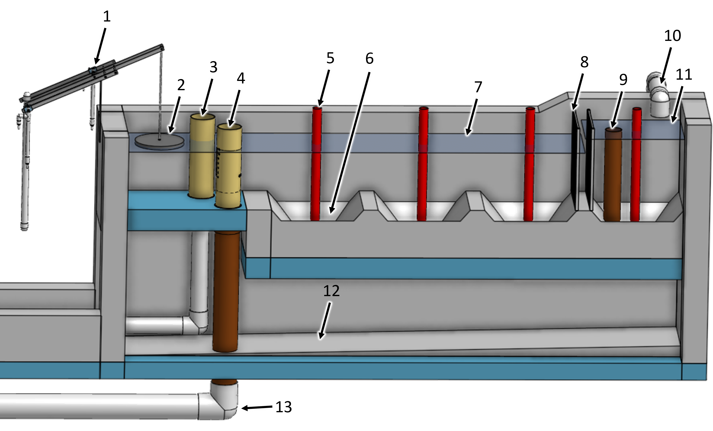
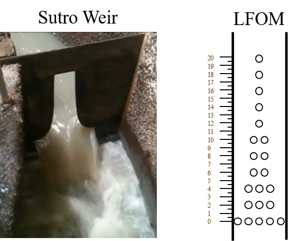
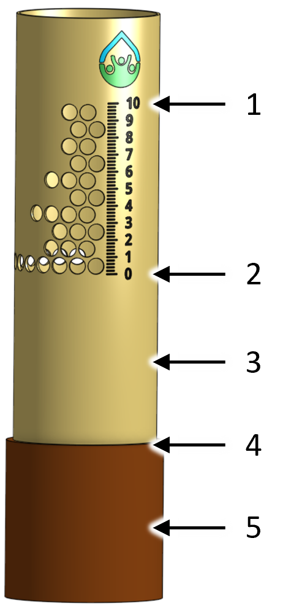

.. _title_Entrance_Tank:

*************
Entrance Tank
*************

Design information for the AguaClara flocculator is available in `the Entrance Tank Design chapter of The Physics of Water Treatment Design <https://aguaclara.github.io/Textbook/Flow_Control_and_Measurement/ET_Design.html>`_

Purpose and Description
-----------------------

The entrance tank (see :numref:`figure_spec_ET_Diagram_Labeled`) has multiple functions in a drinking water treatment plant.

A. Remove air bubbles to reduce splashing, turbulence, and unsteady motion of the chemical feed surface tracking lever system
B. Remove grit to prevent accumulation in the flocculator
C. Remove leaves and other debris to prevent clogging of the diffusers in the clarifier inlet
D. Dissipate kinetic energy to keep the water level steady for accurate flow measurement
E. Measure the incoming flow rate with the Linear Flow Orifice Meter (LFOM) so that operators can make adjustments and respond to changes in water demand
F. Provide a water surface elevation that is proportional to the plant flow rate that is used to automatically ensure the chemical dosages remain constant even as the plant flow rate varies
G. Inject the coagulant and any other amendments required for flocculation

.. _figure_spec_ET_Diagram_Labeled:

    Overview of an entrance tank.

    ===  ============
    Key  Description
    ===  ============
     1   Chemical doser 
     2   Float that tracks the water level created by the LFOM
     3   Bypass
     4   LFOM
     5   Sediment drain pipe stub
     6   Sediment hopper
     7   Maximum water level created by the lfom
     8   Trash rack
     9   Overflow
     10  Raw water inlet
     11  Maximum water level upstream of the trash rack
     12  Drain channel that connects to the main plant drain channel
     13  Pipe leading to the flocculator
    ===  ============

Raw water enters the the entrance tank as shown in :numref:`figure_spec_ET_Diagram_Labeled` and flows across the hoppers at the bottom of the tank. The first hopper contains an overflow pipe to waste any water entering the plant in excess of the plant flow rate. The overflow pipe has a nominal diameter of :sub:`($..et.overflow.ND) no-sub` inches, sized to handle the total plant flow rate. A :sub:`($..et.etHopper.drainND) no-sub` inch nominal diameter removable drain pipe stub is installed in each hopper, allowing the operator to discharge accumulated sediment from the hoppers while the plant is in operation.  

Design Data
-----------

.. _table_Entrance_Tank_Specifications:

.. csv-table:: Entrance Tank Specifications.
   :header: "Parameter", "value"
   :align: left
   :widths: 50 50
   :class: wraptable

   Entrance tank internal width, :sub:`($..et.W) no-sub`
   Entrance tank internal length, :sub:`($..et.L) no-sub`
   Maximum depth of water at the LFOM,  :sub:`($..et.lfomHW) no-sub`
   Number of hoppers, :sub:`($..et.etHopper.N) no-sub`
   Hopper angle,  :sub:`($..et.etHopper.AN) no-sub`
   Drain diameter,  :sub:`($..et.etHopper.drain.ND) no-sub`

Trash Rack
==========

As the raw water flows from the first hopper to the subsequent ones, it must pass through two trash racks, preventing large debris from entering the treatment process. Having two trash racks allows the operator to remove one of the trash racks for cleaning. The trash racks are made of a frame and fishing line or other suitable material. The trash racks are designed to remove any particles that would be large enough to obstruct downstream processes. The smallest flow dimensions are the diffusers in the clarifier with a width of :sub:`($..inletManifold.diffuser.slotW) no-sub` and the orifices in the stacked rapid sand filter inlet branches with a diameter of :sub:`($..filter.fiPipes.branch.inlet.portD) no-sub`. The maximum spacing between the trashrack strings is :sub:`($..trashRack.Sm) no-sub`.

The trash rack area is sufficient such that the fractional clogging can be as high as :sub:`($..et.trashRack.PO_pi) no-sub` before exceeding the maximum available head loss of :sub:`($..et.trashRack.HL_max) no-sub` in the entrance tank.

.. _table_Trash_Rack_Specifications:

.. csv-table:: Trash Rack Specifications.
   :header: "Parameter", "value"
   :align: left
   :widths: 50 50
   :class: wraptable

   Channel width, :sub:`($..trashRack.W) no-sub`
   Trash rack height, :sub:`($..et.trashRack.L) no-sub`
   Fractional open area, :sub:`($..et.trashRack.PO) no-sub`
   Downstream water depth, :sub:`($..et.trashRack.downstreamHW) no-sub`
   Clean head loss, :sub:`($..et.trashRack.HL_min) no-sub`
   Maximum head loss, :sub:`($..et.trashRack.HL_max) no-sub`
   String diameter, :sub:`($..et.trashRack.Dm) no-sub`
   Open space between strings, :sub:`($..et.trashRack.Sm) no-sub`

Sediment and Grit Removal
=========================

The entrance tank has a capture velocity of :sub:`($..et.captureVm) no-sub` to remove particules that would otherwise settle in the bottom of the flocculator. Large particulates settle out in the hoppers, and collect near the drains at the bottom. 

The entrance tank length of :sub:`($..et.L) no-sub` corresponds to the clarifier tank length. The width, :sub:`($..et.W) no-sub`, ensurse the minimum desired capture velocity is met while still allowing enough space for a person to fit inside and construct the tank.

The :sub:`($..et.etHopper.N) no-sub` hoppers collect sand and grit that then slides to the bottom where the :sub:`($..et.etHopper.drain.ND) no-sub` inch nominal diameter drains are located. When too much sediment has accumulated, the drain pipes must be removed until the sludge is flushed out. Directly below the entrance tank, there is a drain channel that transfers the waste to the main plant drain channel.

.. include:: lfom.rst

Linear Flow Orifice Meter
=========================

The LFOM is a weir shape cut into a pipe. It was meant to imitate `the Sutro Weir <https://confluence.cornell.edu/display/AGUACLARA/LFOM+sutro+weir+research>`_ while being far easier to build. The LFOM is a pipe with rows of holes, or orifices, drilled into it. There are progressively fewer holes per row as you move up the LFOM, as the shape is meant to resemble half a parabola on each side. The size of all holes is the same, and the amount of holes per row are precisely calculated. Water in the entrance tank flows into and down the LFOM, towards the rapid mix orifice and flocculator.

.. _figure_sutro_v_lfom:

    On the left is a sutro weir. On the right is AguaClara's approximation of the Sutro weir's geometry. This elegant innovation is called a linear flow orifice meter, or LFOM for short.

The LFOM does one thing and serves two purposes.

What it does:

**The LFOM creates a linear relationship between water level in the entrance tank and the flow out of the entrance tank.** *It does not control the flow through the plant*. If the LFOM were replaced with a hole in the bottom of the entrance tank, the same flow rate would go through the plant, the only difference being that the water level in the entrance tank would scale with flow squared :math:`h \propto Q^2` instead of :math:`h \propto Q`.

Why it is useful:

#. Allows the operator to measure the flow through the plant quickly and easily.
#. Allows for the Linear Chemical Dose Controller, which will be explained next, to automatically adjust the flow of coagulant and chlorine into the plant as the plant flow rate changes. This means the operators only need to adjust the coagulant when there is a need to change the **dose** due to a change in turbidity or organic matter concentration.

This is best understood with examples. By shaping a weir differently, different relationships between :math:`Q` and :math:`h` are formed:
* In the case of a `rectangular weir <https://swmm5.files.wordpress.com/2016/09/image00124.jpg>`_, :math:`Q \propto h^{\frac{3}{2}}`
* In the case of a `v-notch weir <https://swmm5.files.wordpress.com/2016/09/image0096.jpg>`_, :math:`Q \propto h^{\frac{5}{2}}`
* In the case of a `Sutro weir <http://www.engineeringexcelspreadsheets.com/wp-content/uploads/2012/11/Sutro-Weir-Diagram1.jpg>`_ and thus LFOM, :math:`Q \propto h`.

Before the water level reaches the second row of holes, the LFOM is simulating a rectangular weir, and thus :math:`h \not\propto Q`. The Sutro weir also experiences this problem. Similarly, if the water level exceeds the topmost row of the LFOM’s orifices, the linearity also breaks down. The entire LFOM begins to act like an orifice, the exponent of :math:`Q` in :math:`h \propto Q` becomes greater than 1. This is because the LFOM approaches orifice behavior, and for orifices, :math:`h \propto Q^2`.

The diameter of the LFOM pipe is set by the velocity of the falling water inside the LFOM at the bottom of the bottom row of orifices. This velocity is obtained by summing up all of the momentum of the falling water and dividing by the total flow for the case where the LFOM is operating at maximum capacity. The Sutro weir equations can be integrated to obtain an equation for the falling velocity of the water inside the LFOM. 

.. math::
  :label: LFOM_V_max

    V_{max} = \frac{4}{3 \pi} \sqrt{2gh_L}

This maximum vertical velocity of the falling water sets the minimum flow area of the LFOM and hence continuity can be used to obtain the minimum pipe diameter. The orifice pattern was developed to approximate the Sutro weir while simplifying the fabrication.

.. _figure_lfom_overview:

    An AguaClara LFOM showing the flow rate in L/s.

    ====  ============
    Key   Description
    ====  ============
    1     maximum flow rate in L/s and maximum water level
    2     zero flow and minimum water level
    3     pipe stub that can be removed
    4     invert of entrance tank
    5     pipe coupling that is embedded in concrete
    ====  ============

The LFOM specifications are given below.

.. _table_LFOM_Specifications:

.. csv-table:: LFOM Specifications.
   :header: "Parameter", "value"
   :align: center
   :widths: 30 70
   :class: wraptable

   Nominal diameter, :sub:`($..et.lfom.ND) no-sub` inch
   Number of rows of orifices, :sub:`($..et.lfom.rowN) no-sub`
   Max flow rate, :sub:`($..et.lfom.Qm_max) no-sub`
   Head loss at max flow, :sub:`($..et.lfom.HL_max) no-sub`
   Diameter of orifices, :sub:`($..et.lfom.orificeD) no-sub`
   Space between orifices measured on the outside of the pipe,  :sub:`($..et.lfom.orificeS) no-sub`
   Orifices in each row starting from bottom row, :sub:`($..et.lfom.rowOrificeN_VEC) no-sub`
   Elevation of each row from zero flow datum, :sub:`($..et.lfom.rowOrificeH_VEC) no-sub`
