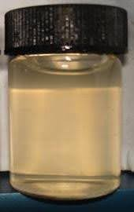
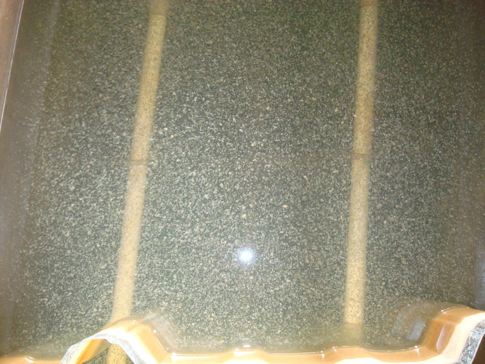
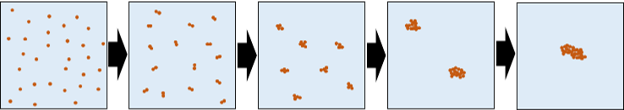
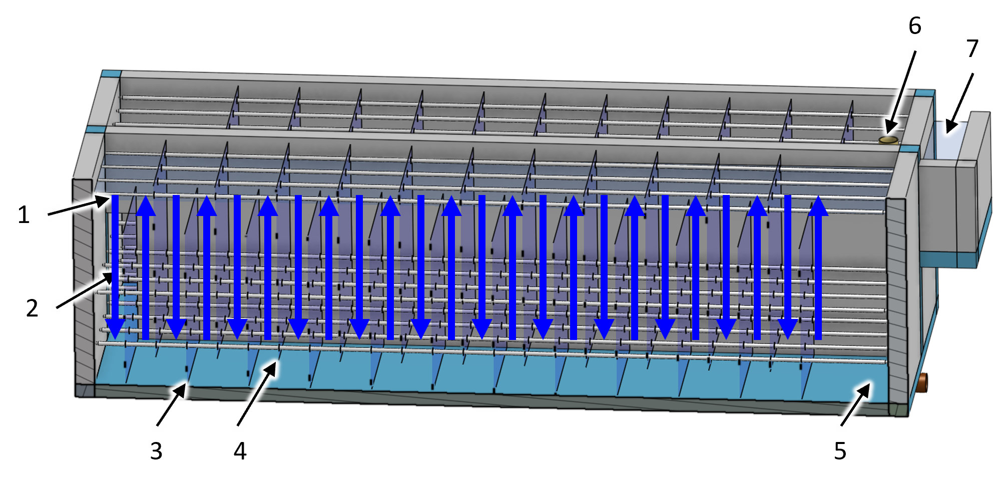
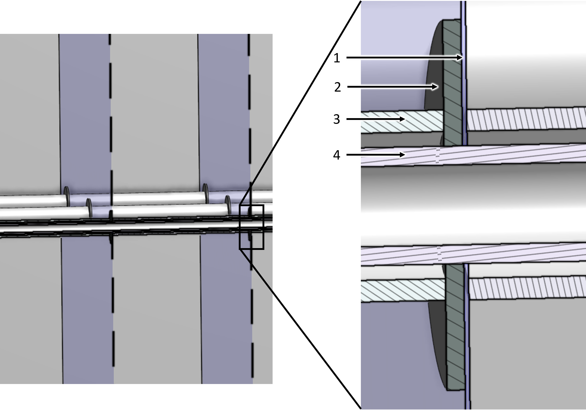

.. _title_Flocculator:

***********
Flocculator
***********

Design information for the AguaClara flocculator is available in `the Flocculation Design chapter of The Physics of Water Treatment Design <https://aguaclara.github.io/Textbook/Flocculation/Floc_Design.html>`_

Purpose and Description
=======================

The flocculator causes particles suspended in the water to collide and agglomerate to form larger aggregates called flocs. These flocs have enough weight to settle easily in the clarifier. The gentle mixing of water with coagulant in the flocculator causes collisions between particles.

.. _figure_turbid_water_sample:

    The cloudy water in the bottle is caused by suspended particles. The goal of the flocculator is to increase the size of the particles so that they have a higher terminal velocity.

.. _figure_floc_image:

    The illuminated flocs at the end of a flocculator are large enough to be visible.

.. _figure_floc_growth:

    Flocs grow by a series of collisions between similar sized flocs. The flocs grow in size from the primary particles with diameters of a few micrometers to large flocs with diameters of a few millimeters. Each of these floc incorporates millions of primary particles.

In an AguaClara plant, the flocculator is a series of channels with sheets or baffles that direct the flow of water in a serpentine path. As the water goes around the end of a baffle the flow first contracts and then expands. This turbulent expansion causes fluid deformation and ultimately promotes collisions between particles.

.. _figure_flocculator_w_flow_path:

    View of an AguaClara flocculator with one wall removed. Blue arrows indicate the direction of water flow between the baffles.

    ===  ============
    Key  Description
    ===  ============
     1   water surface that slopes downward in the direction of flow 
     2   port through the channel wall for flow to pass into the next channel
     3   lower baffle
     4   upper baffle
     5   location where water enters this channel through the hidden wall
     6   pipe stub that can be removed to drain the flocculator
     7   channel connecting the flocculator to the clarifier
    ===  ============

.. _figure_floc_baffle_module:

.. figure:: Images/floc_baffle_module.png
    :width: 600px
    :align: center
    :alt: flocculator baffle module

    The AguaClara modular baffle assembly simplifies both fabrication and maintenance. The baffle assembly can be elevated, as shown in the assembly on the right, to allow water to flow under the baffles during flocculator cleaning and during filling and emptying.

    ===  ============
    Key  Description
    ===  ============
     1   polycarbonate baffle 
     2   PVC pipe frame
     3   temporary pipes used to elevate a baffle assembly while the flocculator is filled with water
    ===  ============

.. _figure_floc_baffle_spacer_detail:

    The washer is located downstream of the polycarbonate baffle so that the force of the water on the baffle is first transferred to the washer before being transferred to the pipe spacer to reduce the forces applied near the hole through the baffle.

    ===  ============
    Key  Description
    ===  ============
     1   polycarbonate baffle 
     2   plastic washer
     3   spacer pipe that sets the spacing between baffles
     4   frame pipe that connects everything together
    ===  ============

Design Data
===========

.. _table_Flocculator_Construction_Data:

.. csv-table:: Flocculator Construction.
    :header: "Parameter", "value"
    :align: left
    :widths: 50 50
    :class: wraptable

    Channel length, :sub:`($..floc.L) no-sub`
    Channel width, :sub:`($..floc.channelW) no-sub`
    Channel wall height, :sub:`($..floc.H) no-sub`
    Number of channels, :sub:`($..floc.channelN) no-sub`
    Number of baffle spaces per channel,  :sub:`($..floc.baffle.spacesN) no-sub`
    Height of upper baffles, :sub:`($..floc.baffleSet.baffle.baffletopL) no-sub`
    Height of lower baffles, :sub:`($..floc.baffleSet.baffle.bafflebottomL) no-sub`
    Baffle extra width for improved water seal,  :sub:`($..floc.baffleSet.baffle.overlapW) no-sub`
    Separation between baffles, :sub:`($..floc.baffle.S) no-sub`
    Height of port between channels, :sub:`($..floc.channelW) no-sub`
    Width of port between channels, :sub:`($..floc.baffle.S) no-sub`
    

.. _table_Flocculator_Hydraulic_Parameters:

.. csv-table:: Flocculator Hydraulic Parameters.
   :header: "Parameter", "value"
   :align: left
   :widths: 50 50
   :class: wraptable

    Collision potential G :math:`\theta`,  :sub:`($..floc.GT) no-sub`
    Average velocity gradient G,  :sub:`($..floc.G) no-sub`
    Minimum water temperature,   :sub:`($..floc.TEMP_min) no-sub`
    Maximum water viscosity,   :sub:`($..floc.NU) no-sub`
    Water volume,   :sub:`($..floc.VOL) no-sub`
    Minimum retention time,  :sub:`($..floc.TI) no-sub`
    Depth of water at exit,  :sub:`($..floc.outletHW) no-sub`
    Total head loss at maximum design flow,  :sub:`($..floc.HL_max) no-sub`
    Average water velocity,   :sub:`($..floc.V) no-sub`
    Baffle minor loss coefficient,   :sub:`($..floc.baffleK) no-sub`
    Baffle H/S ratio,   :sub:`($..floc.HS_pi) no-sub`
    
.. _table_Flocculator_Pipe_Parameters:

.. csv-table:: Flocculator Pipe Parameters.
   :header: "Parameter", "value"
   :align: left
   :widths: 50 50
   :class: wraptable

    Drains,   :sub:`($..floc.drain.ND) no-sub`
    Baffle frame nominal diameter,    :sub:`($..floc.baffleSet.baffle.pipe.ND) no-sub`
    Baffle spacers nominal diameter,   :sub:`($..floc.baffleSet.baffle.spacer.ND) no-sub`

