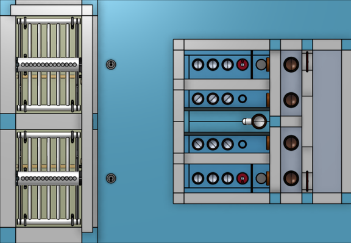

.. _title_StaRS:

*************************
Stacked Rapid Sand Filter
*************************

Design information for the AguaClara Stacked Rapid Sand Filter (StaRS) is available in `the Open Stacked Rapid Sand Filter Design chapter of The Physics of Water Treatment Design <https://aguaclara.github.io/Textbook/Filtration/Filtration_Design.html>`_

Purpose and Description
=======================

The StaRS filter removes particles and pathogens from the clarified water. 

.. _figure_filter_top:

    Filter top view showing filter hydraulic controls and filter chambers for a 2 filter chamber design.

Filter Hydraulic Controls Key
=============================

.. _table_Distribution_to_the_filter_inlet_tanks:

.. csv-table:: Distribution to the filter inlet tanks. |filter_distribution_icon|
    :header: "Key", "Name", "Purpose"
    :align: left
    :widths: 3 25 62
    :class: wraptable

    1, inlet channel, receives the water from :sub:`($..filter.pipes.clarified.N) no-sub` clarified water pipe coming from the clarifier and distributes the water to :sub:`($..filter.fiPipes.bay.N) no-sub` filter chambers
    2, wide weir, uses head loss to divide the flow equally between the filter chambers 
    3, removable gate, can be removed to provide full design flow to a filter during backwash
    4, bypass channel, provides option to bypass the filter by swapping the LFOM and bypass pipes
    5, LFOM, measures the flow rate into the filter
    6, bypass pipe, pipe stub that can be swapped with the lfom to bypass the filter

.. _table_Filter_inlet_tanks:

.. csv-table:: Filter inlet tank. |filter_inlet_icon|
    :header: "Key", "Name", "Purpose"
    :align: left
    :widths: 3 25 62
    :class: wraptable

    7, inlet tank, distributes the clarified water to the 4 filter inlets
    8, overflow, automatically diverts clarified water to the pipe gallery when the filter head loss exceeds the maximum design value
    9, bubble weir, lifts bubbles to prevent them from entering the inlets to the filter
    10, backwash orifice plate, adds head loss to filter inlet 1 during filtration so that it has the same head loss as the other inlets. Removed during backwash.
    11, backwash trunk, deliver water from the inlet tank to the filter chamber during filtration and during backwash
    12, inlet trunks, deliver water from the inlet tank to the filter chamber during filtration

.. _table_Filter_outlet_tank:    

.. csv-table:: Filter outlet tank. |filter_outlet_icon|
    :header: "Key", "Name", "Purpose"
    :align: left
    :widths: 3 25 62
    :class: wraptable

    13, outlet tank, collects filtered water from the 3 outlet trunks
    14, outlet trunks, deliver water from the filter chamber to the outlet tank during filtration
    15, filter to waste, dumps filtered water to the pipe gallery. Remove the pipe stub after backwash to waste filtered water that doesn't meet treatment standards.
    16, filtered water weir, enables filtering to waste
    17, finished water tank, adds chlorine to the filtered water and delivers the water to the finished water pipe
    18, chlorination conduit, provides a path for a chlorination tube to drip into the water exiting from one of the filters
    19, finished water pipe, delivers the finished water to the community water storage tank

.. _table_Filter_chamber:    

.. csv-table:: Filter chamber. |filter_chamber_icon|
    :header: "Key", "Name", "Purpose"
    :align: left
    :widths: 3 25 62
    :class: wraptable

    20, filter chamber, contains the filter internal piping and filtered sand
    21, filter chamber drain, drains water for maintenance operations 
    22, sand dump pipe, empties the sand from the filter
    23, siphon pipe, discharges backwash to the pipe gallery
    24, sand, provides the filter media and pore structure for capture of flocs and particles

.. _table_Filter_internal_piping:    

.. csv-table:: Filter internal piping. |filter_internalPiping_icon|
    :header: "Key", "Name", "Purpose"
    :align: left
    :widths: 3 25 62
    :class: wraptable

    25, band clamps, attach the trunks to the pipes that are embedded in the filter tank chamber wall
    26, winged branch pipes, injects clarified water into the sand bed
    27, slotted branch pipes, extracts filtered water from the sand bed
    28, receptor pipes, terminate and support the winged and slotted branch pipes
    29, trunk spacer, supports the end of the trunks
    30, receptor spacer, supports the receptor spacers
    31, anchor bolts, connects the cable to the concrete slab
    32, cable, prevents the internal pipe modules from lifting during backwash initation
    33, hose clamp, "tightens all of the connections between branches, receptors, and trunks to prevent sand leaks"

Filter Hydraulic Controls Design Parameters
===========================================

.. _table_Distribution_to_the_filter_inlet_tanks_design_parameters.

.. csv-table:: Distribution to the filter inlet tanks design parameters. |filter_distribution_icon|
    :header: "Key", "Name", "Value"
    :align: left
    :widths: 5 55 40
    :class: wraptable
   
    1, **inlet channel**, 
     , Water depth, :sub:`($..filter.ioControls.ioChannelsHW) no-sub`
     , Width, :sub:`($..filter.ioControls.inletW) no-sub`
    2, **wide weir**, 
     , Height, :sub:`($..filter.ioControls.wideWeir.H) no-sub`
     , Width, :sub:`($..filter.ioControls.wideWeir.W) no-sub`
     , Maximum head loss, :sub:`($..filter.ioControls.inletWeirHL) no-sub`
    3, **removable gate**
     , Height, :sub:`($..filter.ioControls.gateOpening.H) no-sub`
     , Width, :sub:`($..filter.ioControls.gateOpening.W) no-sub`
    4, **bypass channel**,
     , Width, :sub:`($..filter.ioControls.bypassW) no-sub`
    5, **LFOM**,
     , Nominal diameter, :sub:`($..filter.ioControls.lfom.ND) no-sub` inch
     , SDR, :sub:`($..filter.ioControls.lfom.SDR) no-sub`
     , Number of rows of orifices, :sub:`($..filter.ioControls.lfom.rowN) no-sub`
     , Max flow rate, :sub:`($..filter.ioControls.lfom.Qm_max) no-sub`
     , Head loss at max flow, :sub:`($..filter.ioControls.lfom.HL_max) no-sub`
     , Diameter of orifices, :sub:`($..filter.ioControls.lfom.orificeD) no-sub`
     , Space between orifices measured on the outside of the pipe,  :sub:`($..filter.ioControls.lfom.orificeS) no-sub`
     , Orifices in each row starting from bottom row, :sub:`($..filter.ioControls.lfom.rowOrificeN_VEC) no-sub`
     , Elevation of each row from zero flow datum, :sub:`($..filter.ioControls.lfom.rowOrificeH_VEC) no-sub`
    6, **bypass pipe**
     , Nominal diameter, :sub:`($..filter.ioControls.bypass.ND) no-sub` inch
     , SDR, :sub:`($..filter.ioControls.bypass.SDR) no-sub`
  
.. _table_Inlet_tanks_design_parameters:

.. csv-table:: Inlet tanks design parameters. |filter_inlet_icon|
    :header: "Key", "Name", "Value"
    :align: left
    :widths: 5 55 40
    :class: wraptable
 
    7, **filter inlet tank**, 
     , Length, :sub:`($..filter.ioControls.inletL) no-sub`
     , Width, :sub:`($..filter.ioControls.inletW) no-sub`
    8, **overflow**, 
     , Nominal diameter, :sub:`($..filter.ioControls.overflow.ND) no-sub` inch
     , SDR, :sub:`($..filter.ioControls.overflow.SDR) no-sub`
     , Maximum water depth, :sub:`($..filter.ioControls.overflow.HW_max) no-sub`
    9, **bubble weir**,
     , Height, :sub:`($..filter.ioControls.bubbleWeir.opening.H) no-sub`
     , Width, :sub:`($..filter.ioControls.bubbleWeir.opening.W) no-sub`
    10, **backwash orifice plate**,
     , Orifice diameter, :sub:`($..filter.ioControls.bwOrifice.D) no-sub`
    11, **backwash trunk**
     , Nominal diameter, :sub:`($..filter.fiPipes.bwTrunk.ND) no-sub` inch
     , SDR, :sub:`($..filter.fiPipes.bwTrunk.SDR) no-sub`
     , Maximum head loss during filtration, :sub:`($..filter.fiPipes.bwTrunk.inletfiHE) no-sub`
     , Maximum velocity during filtration, :sub:`($..filter.fiPipes.bwTrunk.fiV) no-sub`
     , Maximum head loss during backwash, :sub:`($..filter.fiPipes.bwTrunk.inletbwHE) no-sub`
     , Maximum velocity during filtration, :sub:`($..filter.fiPipes.bwTrunk.bwV) no-sub`
    12, **inlet trunks**
     , Nominal diameter, :sub:`($..filter.fiPipes.trunk.ND) no-sub` inch
     , SDR, :sub:`($..filter.fiPipes.trunk.SDR) no-sub`
     , Maximum head loss during filtration, :sub:`($..filter.fiPipes.trunk.inletInnerHE) no-sub`
     , Inner trunks maximum velocity during filtration, :sub:`($..filter.fiPipes.trunk.innerV) no-sub`
     , Inlet 1 (backwash) pipe stub height, none
     , Inlet 2 pipe stub height,  :sub:`($..filter.HSF) no-sub`
     , Inlet 3 pipe stub height,  1.25 * :sub:`($..filter.HSF) no-sub`
     , Inlet 4 pipe stub height,  1.5 * :sub:`($..filter.HSF) no-sub`

.. _table_Outlet_tanks_design_parameters:

.. csv-table:: Outlet tanks design parameters. |filter_outlet_icon|
    :header: "Key", "Name", "Value"
    :align: left
    :widths: 5 55 40
    :class: wraptable
 
    13, **outlet tank**, 
     , Length, :sub:`($..filter.ioControls.outletL) no-sub`
     , Width, :sub:`($..filter.ioControls.outletW) no-sub`
    14, **outlet trunks**,
     , Nominal diameter, :sub:`($..filter.fiPipes.trunk.ND) no-sub` inch
     , SDR, :sub:`($..filter.fiPipes.trunk.SDR) no-sub` inch
    15, **filter to waste**,
     , Nominal diameter, :sub:`($..filter.ioControls.filterToWaste.ND) no-sub` inch
     , SDR, :sub:`($..filter.ioControls.filterToWaste.SDR) no-sub`
    16, **filtered water weir**,
     , Height, :sub:`($..filter.ioControls.HSF) no-sub`
     , Maximum head loss, :sub:`($..filter.ioControls.outletWeirHL) no-sub`
    17, **finished water tank**
     , Half width, :sub:`($..filter.ioControls.finishedWaterW) no-sub`
    18, **chlorination conduit**,
     , Nominal diameter, :sub:`($..filter.ioControls.chlorineConduit.ND) no-sub` inch
     , SDR, :sub:`($..filter.ioControls.chlorineConduit.SDR) no-sub`
    19, **finished water pipe**,
     , Nominal diameter, :sub:`($..filter.pipes.filtered.ND) no-sub` inch
     , SDR, :sub:`($..filter.pipes.filtered.SDR) no-sub`

.. _table_Filter_chambers_design_parameters:

.. csv-table:: Filter chambers design parameters. |filter_chamber_icon|
    :header: "Key", "Name", "Value"
    :align: left
    :widths: 5 55 40
    :class: wraptable

    20, **filter chamber**,
     , Number of filter chambers, :sub:`($..filter.fiPipes.bay.N) no-sub`
     , Number of spare filter chambers, :sub:`($..filter.fiPipes.bay.spare) no-sub`
     , Length, :sub:`($..filter.L) no-sub`
     , Width, :sub:`($..filter.bayW) no-sub`
     , Height, :sub:`($..filter.H) no-sub`
    21, **filter chamber drain**, 
     , Nominal diameter, :sub:`($..filter.slottedDrain.ND) no-sub` inch
    22, **sand dump pipe**,
     , Nominal diameter, :sub:`($..filter.sandDump.ND) no-sub` inch
     , SDR, :sub:`($..filter.sandDump.SDR) no-sub`
     , Discharge height,  :sub:`($..filter.sandDump.H) no-sub`
    23, **siphon pipe**,
     , Nominal diameter, :sub:`($..filter.siphon.ND) no-sub` inch
     , SDR, :sub:`($..filter.siphon.SDR) no-sub`
     , Initial flow rate at beginning of backwash,  :sub:`($..filter.siphon.initialQ) no-sub`
     , Head loss at filter chamber design flow, :sub:`($..filter.siphon.HL) no-sub`
     , Number of orifices,  :sub:`($..filter.siphonManifold.portN) no-sub`
     , Orifice diameter,  :sub:`($..filter.siphonManifold.portD) no-sub`
     , Orifice center to center spacing,  :sub:`($..filter.siphonManifold.portB) no-sub`
     , Nominal diameter siphon control air vent valve,  :sub:`($..filter.airValveND) no-sub`
    24, **sand**
     , Depth,  :sub:`($..filter.fiPipes.sand.H) no-sub`
     , Fluidized depth,  :sub:`($..filter.fiPipes.sand.liveH) no-sub`
     , Density,  :sub:`($..filter.fiPipes.sand.RHO) no-sub`
     , Porosity,  :sub:`($..filter.fiPipes.sand.PO) no-sub`
     , Effective size,  :sub:`($..filter.fiPipes.sand.D_es) no-sub`
     , Clean bed headloss at :sub:`($..filter.TEMP_min) no-sub` ,  :sub:`($..filter.fiPipes.sand.HL_max) no-sub` 
     , Clean bed headloss at :sub:`($..filter.TEMP_max) no-sub` ,  :sub:`($..filter.fiPipes.sand.HL_min) no-sub` 
     , Head loss to fluidize sand,  :sub:`($..filter.fiPipes.sand.bwHL) no-sub`
     , Bulk volume of sand per filter chamber (not accounting for volume of internal pipes),  :sub:`($..filter.fiPipes.sand.VOL) no-sub`
     , Mass of sand per filter chamber (not accounting for volume of internal pipes),  :sub:`($..filter.fiPipes.sand.M) pending version update`

.. _table_Filter_internal_piping_design_parameters:    

.. csv-table:: Filter internal piping design parameters. |filter_internalPiping_icon|
    :header: "Key", "Name", "Value"
    :align: left
    :widths: 5 55 40
    :class: wraptable

    25, **band clamps**,
     , band width,  :sub:`($..filter.fiPipes.band.W) no-sub`
     , band thickness,  :sub:`($..filter.fiPipes.band.T) no-sub`
    26, **winged branch pipes**,
     , Nominal diameter, :sub:`($..filter.fiPipes.branch.inlet.ND) no-sub` inch
      , SDR, :sub:`($..filter.fiPipes.branch.inlet.SDR) no-sub`
    27, **slotted branch pipes**,
     , Nominal diameter, :sub:`($..filter.fiPipes.branch.outlet.ND) no-sub` inch
      , SDR, :sub:`($..filter.fiPipes.branch.outlet.SDR) no-sub`
    28, **receptor pipes**,
     , Nominal diameter, :sub:`($..filter.fiPipes.receptor.pipe.ND) no-sub` inch
      , SDR, :sub:`($..filter.fiPipes.receptor.pipe.SDR) no-sub`
    29, **trunk spacer**,
     , thickness,   :sub:`($..filter.internalPipes.spacer.spacerData.factoryT) no-sub` 
    30, **receptor spacer**,
     , thickness,   :sub:`($..filter.internalPipes.spacer.spacerData.factoryT) no-sub` 
    31, **anchor bolts**,
     , maximum force on anchor bolts, :sub:`($..filter.internalPipes.trunkCableF) no-sub` 
    32, **cable**,
     , diameter,  :sub:`($..filter.internalPipes.spacer.cableD) no-sub` 
     , maximum force on trunk cables, :sub:`($..filter.internalPipes.trunkCableF) no-sub`
    33, **hose clamp**,

.. |filter_distribution_icon| image:: /Images/filter_distribution_icon.png
  :height: 40

.. |filter_inlet_icon| image:: /Images/filter_inlet_icon.png
  :height: 40

.. |filter_outlet_icon| image:: /Images/filter_outlet_icon.png
  :height: 40

.. |filter_chamber_icon| image:: /Images/filter_chamber_icon.png
  :height: 40

.. |filter_internalPiping_icon| image:: /Images/filter_internalPiping_icon.png
  :height: 40

  