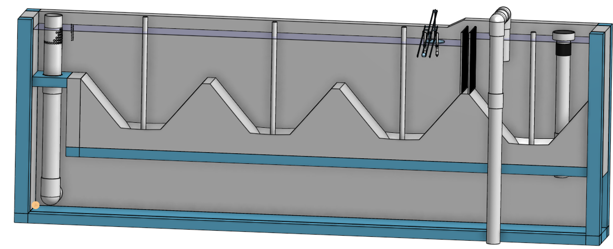
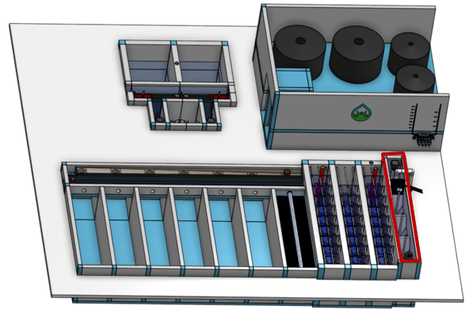

.. csv-table::
   :widths: 45 35 25

   |ACRlogowithname|,  |textbook|, |donate|

|reportabugbig|

.. _title_Entrance_Tank_Configurable_Component:

********************************************
Entrance Tank Configurable Component
********************************************

.. _figure_ET:

    The entrance tank is where the raw water first enters the water treatment plant. It enters through the pipe on the right, passes through the 2 trash racks, flows through the grit removal zone, and exits through the linear flow orifice meter.

.. _figure_ETinPlant:

    The entrance tank (outlined in red) is attached to the flocculator to create a compact plant layout.

The entrance tank has four main functions:
==========================================

  #. Remove trash and debris that could potentially clog the diffusers in the inlet manifold to the clarifier.
  #. Remove grit and sand that would otherwise settle in the flocculator.
  #. Measure the flow rate entering the plant using a Linear Flow Orifice Meter.
  #. Automatically vary the chemical feed rates as the plant flow rate changes with the chemical doser.

Generate New Models of the Entrance Tank
========================================

Edit the configurations to create new models of the entrance tank. Some models may fail because the constraints can't all be met. Send us `feedback to share how you are using the entrance tank model, to give us suggestions for how to make these models easier to use, and to <https://forms.gle/cqDPapYkcSmLnDu4A>`_ |reportabug|.

.. csv-table:: Entrance tank configuration parameters.
   :header: "Configuration", "Description"
   :align: left
   :widths: 50, 100

   "",""
   "Flow (L/s)", "The maximum flow rate sets the size of the entrance tank. Vary it to see how the dimensions change."
   "",""
   Minimum temperature (˚C), The flow is turbulent throughout the entrance tank and thus temperature doesn’t have a significant effect on the design.
   "",""
   Channel length (m), The inside length of the entrance tank that enables fitting the entrance tank next to the flocculator to make a compact plant layout.
   "",""
   Flocculator water depth at entrance (m), The entrance tank is built on the same slab as the flocculator and the elevation of the water leaving the entrance tank must match the water level at the entrance of the flocculator.
   "",""
   Capture velocity (mm/s), The capture velocity for removal of grit. The entrance tank will capture grit that has a terminal velocity faster than this capture velocity. This determines the plan view area of the hoppers in the entrance tank.

Additional information is available in the chapter on `Entrance Tank Design <https://aguaclara.github.io/Textbook/Flow_Control_and_Measurement/ET_Design.html>`_

.. |donate| image:: ./Images/donate.png
  :target: https://www.aguaclarareach.org/donate-now
  :height: 30

.. |textbook| image:: ./Images/textbook.png
  :target: https://aguaclara.github.io/Textbook/AIDE/AIDE.html
  :height: 30

.. |ACRlogowithname| image:: ./Images/ACRlogowithname.png
  :target: https://www.aguaclarareach.org/
  :height: 40

