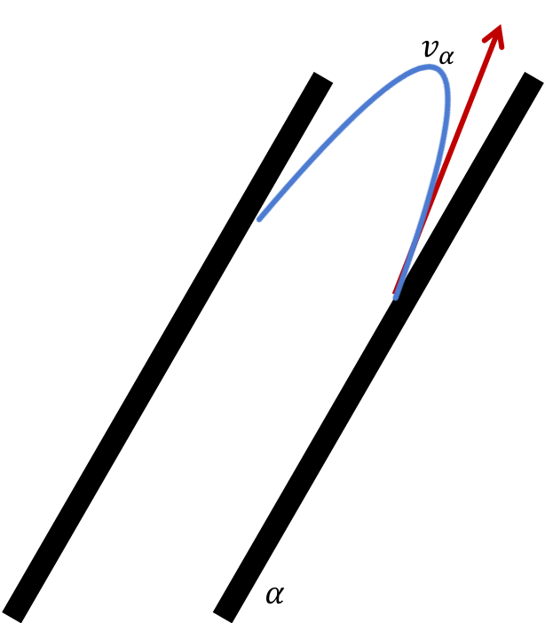

.. raw:: html

    <embed>
       <link rel="canonical" href="https://aguaclara.github.io/Textbook/Clarification/Clarifier_Derivations.html" />
       
    </embed>

.. _title_Clarifier_Derivations:

*********************
Clarifier Derivations
*********************

Floc Filter Design
==================

Velocity Gradient
-------------------

The velocity gradient in the floc filter could cause some collisions between particles. We demonstrate that this is NOT a significant effect below. The velocity gradient in the floc filter is obtained from the head loss through a fluidized bed. We will use Equation :eq:`G_Camp_Stein` to converts the energy dissipation rate into a velocity gradient.

.. math::

 \bar \varepsilon = \frac{gh_L}{\theta}

We will start by determining :math:`\varepsilon` by calculating :math:`\theta` using the porosity of the floc filter, :math:`\phi_{ff}`,

.. math::

  \theta = \frac{H_{ff} \phi_{ff}}{\bar v_{z_{ff}}}

Plugging :math:`\theta` into :math:`\varepsilon` yields

.. math::

  \bar \varepsilon = \frac{g \bar v_{z_{ff}}}{\phi_{ff}} \frac{h_L}{H_{ff}}

Substituting into our equation for :math:`G`,

.. math::

  \tilde{G} =  \sqrt{\frac{g \bar v_{z_{ff}}}{\nu \phi_{ff}} \frac{h_L}{H_{ff}}}

Using our equation for :math:`h_L`,

.. math::

  \tilde{G} =  \sqrt{\frac{g \bar v_{z_{ff}}}{\nu \phi_{ff}} \left( \frac{1}{\rho_{H_2O}} - \frac{1}{\rho_{clay}} \right) C_{clay} }

:math:`\phi_{ff} \approx 1` and is a function of :math:`C_{clay}`

We can plot our results for :math:`\tilde{G}` over a range of typical floc filter concentrations, which is around 1 - 5 g/L. We find that :math:`\tilde{G}` ranges from 2 to 6 Hz. Recall that for flocculator design, we get anywhere from 70 to several hundred Hz. The :math:`\tilde{G}` provided by the floc filter is much smaller than :math:`\tilde{G}` provided by the flocculator. This is an important point because in the low :math:`\tilde{G}` environment of the floc filter where there are low levels of energy dissipation, we can grow larger flocs. The flocs are experiencing less shear so they can grow close to millimeter size.

We can plot our results for :math:`\tilde{G}\theta` by multiplying :math:`\tilde{G}` by the residence time we found earlier, :math:`\theta = 1000 s`. The result is that :math:`Gv\theta` ranges from 2,000 to 6,000. Compare this to the :math:`\tilde{G}\theta = 20,000` for the flocculator used in experiments (`Garland et al., 2017 <https://www.liebertpub.com/doi/10.1089/ees.2016.0174>`_).

.. _figure_lab_setup:

.. figure:: ../Images/lab_setup.png
   :height: 300px
   :align: center
   :alt: Lab setup for flocculator, half-clarifier, and plate settler testing.

   Lab setup for flocculator, half-clarifier, and plate settler testing.

.. _figure_floc_conc_G:

.. figure:: ../Images/floc_conc_G.png
   :height: 300px
   :align: center
   :alt: Velocity gradient and collision potential as a function of floc filter concentration.

   Velocity gradient and collision potential as a function of floc filter concentration.

How does such a small :math:`\tilde{G}\theta` cause such a large reduction in turbidity? The question we are really asking is, is there anything special about the :math:`\tilde{G}\theta` provided by the floc filter compared to the :math:`\tilde{G}\theta` provided by the flocculator? If so, what is the difference and why is it so beneficial?

Experimental data helps explain this. Two systems were set up: one had a flocculator where :math:`\tilde{G}\theta = 20,000` with a floc filter where :math:`\tilde{G}\theta = 4,000`; the other just had a flocculator where :math:`\tilde{G}\theta = 24,000`. Using the same influent water quality and coagulant dosing, we find that the first system with the flocculator and floc filter performed better than the second system, even though the overall :math:`\tilde{G}\theta` values were the same.

To understand this, we have to review assumptions in the derivation for :math:`\tilde{G}`. Recall our assumption that fluid shear promotes the collision of two primary particles instead of the collision of primary particles with existing, large flocs. If our assumption was true, we would expect to see no difference between our two experimental setups. However, because we know that the two experimental setups did have different results, our assumption must be false because the assumption does not explain or account for these differences. There must be another mechanism occurring to explain why the floc filter greatly improves treatment quality. This leads us to believe that the flocs in the floc filter must be more involved than simply providing shear and velocity gradients; they must be capturing the small particles coming through the floc filter.

This highlights an important distinction:

#. The model created by the original derivation assumption would suggests that flocs in the floc filter are inert - simply occupying space and causing there to be head loss in the floc filter - without being involved in any collisions. This model is disproved through the experimental analysis of the two experimental setups.
#. The model created after the analysis of experimental results suggests that flocs in the floc filter are not inert - they are involved in collisions with small particles entering the floc filter - and are becoming more dense, less porous, and with a higher fractal dimension.

Collision Potential
---------------------
We have learned that growing a floc filter leads to better clarifier performance. One explanation for the improved performance is that the floc filter acts like an additional flocculator because there are additional collisions between particles. To understand the nature and significance of these additional collisions, we can calculate the floc filter velocity gradients and residence time to find collision potential, :math:`G\theta`. In a floc filter, we expect that :math:`G` is small; however, :math:`\theta` is large, which means that :math:`G\theta` in the floc filter may be significant.

First, we will find :math:`\theta`. If we simplify the bottom of the clarifier and approximate it as a simple rectangle, we can easily determine the residence time. If the depth of the floc filter is 1 m and the upflow velocity is 1 mm/s, we determine that

.. math::

  \theta = 1000 s

Next, we will find :math:`G`. Before we begin, consider why there is a velocity gradient in the floc filter. What causes it? Water is flowing up through the floc filter while the flocs in the floc filter are being pulled down by gravity. The differential velocities are caused by particles settling and rising at different velocities relative to the fluid due to drag, gravity, and fluid flow. In the fluid around each particle, there is a velocity gradient and shear between the particles and the surrounding fluid.

Entering the clarifier, there is a large range of particle sizes in the water. The range exists from big flocs made up with hundreds of millions of clay particles to primary particles that made it through flocculation without successful collision. These differentially sized particles create velocity gradients as the particles and flocs are acted on by both settling forces and upward fluid flow forces.

Large flocs provide velocity gradients that can potentially cause collisions between other small particles that we are still trying to capture. Through our derivation to determine :math:`G` in a floc filter, we will also test an assumption. We will assume that primary particles coming into the floc filter are not interacting with large flocs. Instead,  we will assume that the the fluid shear and differential velocities promote interactions between two primary particles.

So, how can we calculate the velocity gradient? In flocculators, we determined :math:`G` from head loss and residence time. In clarifiers, we determine :math:`G` the same way. Let's calculate the head loss through the floc filter. To do this, we need to know the density of the floc filter and we need to know the relationship between head loss a fluidized bed and density of the bed.

Density
----------
To calculate the density of the floc filter at steady-state, we will use principles of mass and volume conservation.

.. math::

  C_{clay} = \frac{m_{clay}}{\forall_{ff}}

.. math::

  \rho = \frac{m_{TOT}}{\forall}

We will start by finding the mass of clay and the mass of water in the floc filter, where:

| :math:`C_{clay} =` concentration of clay in the floc filter
| :math:`\forall_{ff} =` volume of floc filter
| :math:`\rho_{clay} =` density of clay
| :math:`\rho_{H_2O} =` density of water
| :math:`\rho_{ff} =` density of floc filter

The mass of clay in the floc filter is concentration multiplied by volume, shown by :math:`m_{clay} = C_{clay}\forall_{ff}`

The mass of water in the floc filter is related to the volume fraction of the floc filter that is occupied by clay, :math:`\frac{C_{clay}}{\rho_{clay}}`, whic is a very small number. :math:`\left( 1 - \frac{C_{clay}}{\rho_{clay}} \right)` is the fraction of the floc filter that is occupied by water, also called the water volume fraction. So, :math:`m_{H_2O} = \left( 1 - \frac{C_{clay}}{\rho_{clay}} \right) \rho_{H_2O} \forall_{ff}`.

Now, we know how much clay and water is in our system. The density of the system, neglecting the addition of coagulant, is,

.. math::

  \rho_{ff} = \frac{m_{clay} + m_{H_2O}}{\forall_{ff}}

Substituting for :math:`m_{clay}` and :math:`m_{H_2O}`,

.. math::

  \rho_{ff} = \left( 1 - \frac{C_{clay}}{\rho_{clay}} \right)\rho_{H_2O} + C_{clay}

This can be rearranged to yield the following equation derived from first principles,

.. math::

  \rho_{ff} = \left( 1 - \frac{\rho_{H_2O}}{\rho_{clay}} \right)C_{clay} + \rho_{H_2O}

AguaClara researchers in the lab developed an empirical equation through experimental studies to calculate floc filter density. They determined that,

.. math::
  \rho_{ff} = 0.687C_{clay} + \rho_{H_2O}

Comparing the empirical equation to the one determined by first principles, it is clear that the coefficient,

.. math::

  \left( 1 - \frac{\rho_{H_2O}}{\rho_{clay}} \right) = 0.687

Head Loss
-----------

Now that we can calculate the density of the floc filter, we can calculate the head loss through the floc filter. This topic will be discussed further in the chapter on filtration. For now, all you need to know is that density can be related to head loss in the floc filter through the height of the floc filter, :math:`H_{ff}`, and the densities of the floc filter and water.

.. math::

  \frac{h_L}{H_{ff}} = \frac{\rho_{ff} - \rho_{H_2O}}{\rho_{H_2O}}

There will be a small amount of head loss through the floc filter because the density of the floc filter is greater than the density of water by only a little bit. Remember that :math:`\frac{C_{clay}}{\rho_{clay}}` is really just the fraction of the floc filter that is occupied by clay.

Plugging in the equation for :math:`\rho_{ff}` and solving for :math:`h_L`,

.. math::
  :label: floc_filter_head_loss

  h_L = H_{ff} \left( \frac{\rho_{clay}}{\rho_{H_2O}} - 1 \right) \frac{C_{clay}}{\rho_{clay}}

.. _heading_Flocculator_Floc_Filter_Paradox:

Flocculator and Floc Filter Paradox
--------------------------------------

We now have a very interesting apparent contradiction between our conclusions about flocculation and floc filters. We previously concluded that primary particles do not collide with and attach to flocs in flocculators. This assumption is required to explain experimental observations. Indeed, if primary particles could attach to flocs in a flocculator, then high turbidity events with appropriate coagulant dosages should result in super performance because there would be so many opportunities for collisions between large flocs and primary particles. This is not what we observe.

The contradiction is that now we conclude that primary particles must be attaching to flocs in the floc filter! Both of these conclusions are based on a combination of experimental measurements and careful application of models. If these apparently contradictory conclusions are both correct, then there must be some fundamental difference between the particle interactions in flocculators and floc filters.

In both environments the flow around the flocs is dominated by viscous forces. The source of the fluid deformation is different in these two flows. In the flocculator the source of the fluid deformation is from turbulent kinetic energy that is dissipating by deforming (shearing) the fluid. In the floc filter the source of fluid deformation is from the gravitational pull on the flocs. The flocs are moving relative to the fluid and the fluid is being deformed as the flocs move through the fluid.

.. _table_flocculator_vs_floc_filter:

.. csv-table:: Comparison between flocculator and floc filter.
   :header: "Property", "Flocculator", "Floc filter"
   :align: center

   Velocity gradient, ~100 Hz, x Hz
   :math:`\tilde{G}\theta`, "20,000 - 40,000", "x,000 to y,000"
   energy source for fluid deformation, turbulence, floc drag
   flow regime at floc length scale, shear flow, velocity field is perturbed by falling flocs
   flocs are..., rotating from fluid shear, falling due to gravity
   flocs have a stagnation point, no, yes

Flocs that are rotating in a shear flow drag a boundary layer of fluid with them as they rotate. This boundary layer of fluid prevents any approaching fluid from penetrating to the surface of the floc. There is no stagnation point on the floc! This means that approaching particles are swept around the floc due to the presence of the boundary layer. The only way for a particle to collide with a large floc is for the particle to be large enough that it can penetrate through the boundary layer even though the center of the particle continues to follow the streamline around the boundary layer of the floc.

Flocs with low fractal dimensions that are falling through a fluid that is not undergoing significant shear have a small amount of fluid passes directly through the floc where any particles in the flow can collide with particles that are held inside the floc. Thus the floc is the filter and the filter media is the particles that make up the floc. This is why we call it a floc filter. Particles are filtered by individual flocs and are retained inside the floc. As particles accumulate inside the floc the floc porosity decreases and the flow through the floc decreases. Eventually the floc becomes ineffective as a filter because its filtration capacity has been exhausted.

.. _heading_Clarifier_Plate_Settler_Design:

Plate Settler Design
====================

The vertical component of the velocity in the plate settlers is greater than the vertical velocity in the floc filter due to the lost triangle at the one end of the plate settlers and due to the thickness of the plate settlers (:numref:`figure_clarifier_velocities`).

.. _figure_clarifier_velocities:

.. figure:: ../Images/clarifier_velocities.png
    :height: 300px
    :align: center
    :alt: velocities in the clarifier.

    Clarifier vertical velocity components in the floc filter, the active plate settler zone, and inside the plate settlers.

Parameters
-----------

From the relationship that :math:`\bar v_{z_{Plate}}*S = \bar v_{z_{Active}}*B`, we can solve for :math:`B` or :math:`L` in terms of their related parameters.

Let's start with the relationships that we already know:

.. math::

  \bar v_{z_{Plate}}*S = \bar v_{z_{Active}}*B

and

.. math::

  B = S+T

.. _figure_SvsBplatesettlers:

.. figure:: ../Images/SvsBplatesettlers.png
    :height: 300px
    :align: center
    :alt: Thick plate settlers.

    Thick plate settlers.

.. _figure_plate_settler_base:

.. figure:: ../Images/plate_settler_base.png
    :height: 300px
    :align: center
    :alt: Plate settlers.

    Plate settlers.

Solving for :math:`\bar v_{z_{Plate}}`, we rearrange and substitute by,

.. math::

  \bar v_{z_{Plate}} S = \bar v_{z_{Active}} (S+T)

.. math::

  \bar v_{z_{Plate}} = \frac{\bar v_{z_{Active}} (S+T)}{S}

We also already know from our :ref:`discussion of plate settlers <heading_Clarifier_Plate_Settlers>` that we can relate capture velocity, :math:`\bar v_c`, to :math:`S, L, \alpha`, and :math:`\bar v_{z_{Plate}}` by,

.. math::
  :label: vc_of_vz_plate

  \bar v_c = \frac{S  \bar v_{z_{Plate}}}{L sin\alpha cos\alpha + S}

Substitute for :math:`\bar v_{z_{Plate}} = \frac{\bar v_{z_{Active}}(S+T)}{S}` by,

.. math::
  :label: vc_of_vz_

  \bar v_c = \left(\frac{S}{L sin\alpha cos\alpha + S}\right)\left(\frac{\bar v_{z_{Active}}(S+T)}{S}\right)

Now, we can use this form of the capture velocity equation to solve for :math:`L`, as shown by,

.. math::
  :label: L_plate_settler

  L = \frac{S\left(\frac{\bar v_{z_{Active}}}{\bar v_c}-1\right) + T\left(\frac{\bar v_{z_{Active}}}{\bar v_c}\right)}{sin\alpha cos\alpha}

.. _heading_Clarifier_Plate_Settler_Design_Review:

.. csv-table:: AguaClara plate settler design approach.
   :header: "Parameter", "Variable", "Determined by:", "Determines:", "Value"
   :align: left

   Upflow velocity, :math:`\bar v_{z_{ff}}`, Floc filter, Plan view area of tank, 1 :math:`\frac{mm}{s}`
   Capture velocity, :math:`\bar v_c`, Target turbidity, Particle size distribution, 0.12 :math:`\frac{mm}{s}`
   Plate angle, :math:`\alpha`, Self-cleaning requirements, :math:`L`, 60 deg
   Plate spacing, :math:`S`, Clogging and floc rollup constraints, :math:`L`, 2.5 cm
   Plate settler length, :math:`L`, ":math:`\bar v_{z_{ff}}, \bar v_c, \alpha, S`",Tank depth, Calculated for each plant

The relationship between the vertical velocity and the velocity in the direction of the sloped tube or plate settlers is given by

.. math::

  \bar v_{z} = \bar v_{\alpha} \sin \alpha

.. _table_lamellar_settler_geometry:

.. csv-table:: Lamellar settler geometry and relevant equations.
   :header: "Settler geometry", "Single tubes", "Multiple tubes or plates"
   :align: left

   ":math:`\bar v_{z}` ratio", ":math:`\frac{\bar v_{z_{Tube}}}{\bar v_{c}}=\frac{L}{D} \cos \alpha \sin \alpha+\sin ^{2} \alpha`", ":math:`\frac{\bar v_{z_{Plate}}}{\bar v_{c}}=\frac{L}{S} \cos \alpha \sin \alpha+1`"
   ":math:`\bar v_{\alpha}` ratio  ",":math:`\frac{\bar v_{\alpha_{Tube}}}{\bar v_{c}}=\frac{L}{D} \cos \alpha +\sin \alpha`", ":math:`\frac{\bar v_{\alpha_{Plate}}}{\bar v_{c}}=\frac{L}{S} \cos \alpha +\frac{1}{\sin \alpha}`"

For single tube settlers used in laboratory settings the

.. math::

  \bar v_{\alpha_{Tube}}=\frac{4Q_{Tube}}{\pi D^2}

Substituting into the equation for single tube settlers

.. math::
  :label: Q_tube_settler

  Q_{Tube}=\frac{\bar v_{c}\pi D^2}{4} \left(\frac{L}{D} \cos \alpha +\sin \alpha \right)

It is common to need to design the length of the tube given a target flow rate and thus we have

.. math::
  :label: L_tube_settler

  L = \frac{4Q_{Tube}}{\bar v_{c}\pi D\cos \alpha} - D\tan\alpha

.. _heading_Floc_Rollup_Derivation:

Floc Rollup
------------------------------

As has been discussed, :ref:`floc rollup <heading_Floc_Rollup>` is a failure mode of plate settler performance. To determine the appropriate spacing between plate settlers, we must consider the potential for flocs to rollup because we want to minimize rollup and promote settling. We will determine the minimum plate spacing that will allow flocs that settle on the plate to slide down and return to the floc filter. The steps to calculate this are:

#. Find the velocity gradient next to the plate

#. Find the fluid velocity at the center of the floc

#. Find terminal velocity of the floc down the plate (for the case of zero velocity fluid)

#. Set those two velocities equal for the critical case of no movement, and the required plate spacing

#. Find the floc terminal velocity, :math:`v_{Slide}`

We will solve for both the plate settler and tube settler conditions.

**1) Find the velocity gradient next to the plate:**

The velocity gradient is given by Equation :eq:`plate_settler_G_wall`

.. _figure_plate_settler_boundary_conditions:

.. figure:: ../Images/plate_settler_boundary_conditions.png
    :height: 300px
    :align: center
    :alt: Boundary conditions in plate settlers.

    Boundary conditions in plate settlers.

.. _figure_floc_rollup_base:

.. figure:: ../Images/floc_rollup_base.png
    :height: 300px
    :align: center
    :alt: Velocity profile between plate settlers.

    Velocity profile between plate settlers.

.. _figure_floc_rollup_step1:

   Velocity gradient next to the plate.

For tube settlers the velocity gradient at the wall is given by Equation :eq:`G_wall_laminar_tube`.

**2) Find the fluid velocity at the center of the floc:**

Now, we want to determine the velocity at the center of the floc. For flow between parallel plates we determined that,

.. math::

  \frac{d v_{\alpha_{Plate}}}{dy}_{y = 0} = \frac{6 \bar v_{\alpha_{Plate}}}{S}

The center of the floc is approximately half of the floc diameter, :math:`D_{floc}`. So, to find the fluid velocity at the center of the floc, we linearize the differential and plug in :math:`\frac{D_{floc}}{2}` to yield,

.. math::

  v_{\alpha} \approx \frac{6 \bar v_{\alpha_{Plate}}}{S} \frac{D_{floc}}{2}

Substituting by the trigonometric relationship :math:`\bar v_{\alpha_{Plate}} = (\frac{\bar v_{z_{Plate}}}{sin\alpha})`, we find the fluid velocity at the center of the floc as,

.. math::

  \bar v_{\alpha_{Plate}} \approx \frac{3 \bar v_{z_{Plate}} D_{floc}}{Ssin\alpha}

.. _figure_floc_rollup_step2:

.. figure:: ../Images/floc_rollup_step2.png
   :height: 300px
   :align: center
   :alt: Fluid velocity at the center of the floc.

   Fluid velocity at the center of the floc.

**3) Find terminal velocity of the floc down the plate (for the case of zero velocity fluid):**

The terminal velocity of a floc is given by Equation :eq:`vt_of_floc`.

.. _figure_floc_rollup_step3:

.. figure:: ../Images/floc_rollup_step3.png
   :height: 300px
   :align: center
   :alt: Terminal velocity of the floc down the plate (for the case of zero velocity fluid).

   Terminal velocity of the floc down the plate.

**4) Set the fluid velocity at the center of the floc equal to the terminal velocity of the floc to find the critical case of no movement, and the required plate spacing:**

The floc settles due to gravitational forces. First, the :math:`\alpha` component of the gravitational settling force, :math:`v_{t,\alpha}`, must be found by trigonometric relationships.

.. math::

  v_{t,\alpha} = v_t sin\alpha

Setting :math:`v_{\alpha} = v_{t,\alpha}` yields,

.. math::

  \frac{3 \bar v_{z_{Plate}} D_{floc}}{Ssin\alpha} \approx v_t sin\alpha

Solving for :math:`S` to determine plate spacing,

.. math::

  S \approx \frac{3 \bar v_{z_{Plate}} D_{floc}}{v_t sin^2\alpha}

In this equation, we have both :math:`v_t` and :math:`D_{floc}`, but we can simplify further because we know that :math:`v_t` and :math:`D_{floc}` are related by the relationship shown in step 3. The goal is to ensure that flocs that settle to the plates do not roll up. We replace the unknown diameter of the floc with its terminal velocity and set that to be the capture velocity, :math:`v_c` for the plate settler.

.. math::
  :label: Plate_S_min_of_fractal

  S_{min} \approx \frac{3 D_{cp}}{sin^2\alpha} \frac{\bar v_{z_{Plate}}}{v_c}  \left( \frac{18 v_c \nu }{D_{cp}^2g} \frac{ \rho_{H_2O}}{ \rho_{cp} - \rho_{H_2O}} \right) ^{\frac{1}{ \Pi_{fractal} - 1}}

:math:`S_{min}` is the smallest spacing that will allow a floc with a given settling velocity to remain stationary on the slope and not be carried upward by rollup.

If the fractal dimension, :math:`\Pi_{fractal}` has a value of 2, then Equation :eq:`Plate_S_min_of_fractal` can be simplified.

.. math::
  :label: Plate_S_min_of_fractal_of_2

  S_{min} \approx \frac{3 \bar v_{z_{Plate}}}{\sin^2 \alpha} \left( \frac{18 \nu}{g D_{cp}} \frac{\rho_{H_2O}}{\rho_{cp} - \rho_{H_2O}} \right)

A plot of Equation :eq:`Plate_S_min_of_fractal_of_2` reveals that the minimum spacing is strongly influenced by the density of the core particle and by the temperature. The minimum spacing increases as the size of the primary particle, :math:`D_{cp}`, decreases. This is an important insight because flocs that are made of coagulant nanoparticles and dissolved organics are the most difficult flocs to capture. Flocs made of coagulant nanoparticles are less dense than flocs made of clay. Coagulant nanoparticle flocs are produced when water treatment plants are used to remove dissolved organics or arsenic or when high coagulant dosages are used.

.. _figure_SofRollupwithfractal2:

.. figure:: ../Images/SofRollupwithfractal2.png
   :height: 300px
   :align: center
   :alt: Floc roll up as a function of core particle density and temperatures

   Plate settler spacing must increase to capture low density flocs.

Given that AguaClara uses a lower upflow velocity, :math:`\bar v_{z_{Plate}}`, than many plate settler designs it is reasonable for us to use more closely spaced plates. More work is required to characterize the density and size of the core particles as a function of raw water constituents to provide guidance on the required plate spacing.

AguaClara plate settlers are currently using separations of 2.5 cm, which is far above the constraint of floc roll up except for very low density flocs. As floc density decreases, as we expect for organic matter, minimum spacing increases. However, we don't yet know what that spacing is or where the boundary is because we don't know the properties of the humic acid-coagulant flocs. Further research is required here to determine the floc properties of flocs that are dominated by dissolved organic matter.

.. _heading_Clarifier_Hl_thru_Plate_Settlers:

Head Loss Through Plate Settlers
--------------------------------

Flow through the clarifier is controlled by head loss in an attempt to achieve flow uniformity. We have already explained that :ref:`plate settler spacing impacts head loss <heading_Clarifier_Plate_Settlers_Head_Loss_Intro>`, but by what mathematical relationship? Will putting plate settlers closer together result in more or less head loss? This question is complicated because closer plate settlers would create more shear and head loss, but shorter plate settlers have less area which would decrease the head loss.

Let's start with a force balance similar to the derivation for head loss between parallel plates as done previously for Equation :eq:`parallel_plate_laminar_headloss`. Assume that there is a fully established velocity profile that is parabolic with laminar flow. The forces that we care about are shear forces on the walls of the plate settlers and the differential pressure from flow in the direction of the velocity.

.. _figure_plate_settler_headloss_diag:

.. figure:: ../Images/plate_settler_headloss_diag.png
   :height: 300px
   :align: center
   :alt: Velocity, shear forces, and pressure loss through plate settlers.

   Velocity, shear forces, and pressure loss through plate settlers.

The shear forces act over the area of the two plates, resulting in :math:`F_{shear} = 2 \tau L W` where :math:`\tau` is the viscous shear component.

The pressure force is exerted over the entire width of the plate and the plate spacing. Pressure at the entrance of the plate settlers is different from the exit of the plate settlers by :math:`\Delta P`. The resulting pressure force is :math:`F_{pressure} = \Delta P W S`. So,

.. math::

  F_{shear} = F_{pressure}

.. math::

  2 \tau L W = \Delta P W S

Dividing both sides by width, :math:`W`, and solving for :math:`\Delta P` yields,

.. math::

  \Delta P = \frac{2 \tau L}{S}

We need to figure out what each of the terms on the right side of the equation is equal to so we can calculate :math:`\Delta P`. Ultimlately, we need :math:`\Delta P` to calculate head loss because :math:`h_L = \frac{\Delta P}{\rho g}`.

:math:`\tau =\mu \frac{du}{dy}`, where :math:`\tau` is shear, :math:`\mu` is the viscosity, and :math:`\frac{du}{dy}` is the velocity gradient. Using the Navier-Stokes equation, we can find the velocity gradient as a function of the average velocity between the plates, yielding shear based on the vertical velocity entering the plates as,

.. math::

  \tau = \mu \frac{6 \bar v_{z_{Plate}}}{S sin\alpha}

:math:`L` is found using the equation for capture velocity, :math:`\bar v_c = \frac{S*\bar v_{z_{Plate}}}{Lsin\alpha cos\alpha + S}`. Capture velocity is kept constant so we solve for :math:`L`,

.. math::

  L = \frac{S \left( \frac{\bar v_{z_{Plate}}}{\bar v_c} -1 \right)}{sin\alpha cos\alpha}

Substituting :math:`\tau` and :math:`L` into the equation for :math:`\Delta P`,

.. math::

  \Delta P = 2\mu \left( \frac{6 \bar v_{z_{Plate}}}{S sin^2 \alpha cos\alpha} \right) \left( \frac{ \bar v_{z_{Plate}}}{\bar v_c} -1 \right)

Now that we have an equation for :math:`\Delta P`, we can solve for head loss.

.. math::

  h_L = \frac{\Delta P}{\rho g}

.. math::
  :label: plate_settler_headloss

  h_L = 2 \frac{\mu}{\rho g} \left( \frac{6 \bar v_{z_{Plate}}}{S sin^2 \alpha cos\alpha} \right) \left( \frac{ \bar v_{z_{Plate}}}{\bar v_c} -1 \right)

Recall that head loss through plate settlers is really small, on the order of micrometers, :math:`\mu m`. We are interested in understanding how the head loss relates to velocity, through the relation :math:`v = \sqrt{2gh}`. The resulting two plots show how head loss and velocity relate to plate settlers (see :numref:`figure_plate_settler_headloss_spacing`).

Jet Velocity
--------------

:math:`\bar v_{jet}` is defined as the velocity of the water jet exiting the diffuser. After exiting the diffuser, this water jet is sent into the jet reverser to make a 180 degree turn. Does the water jet change pressure or velocity as it exits the jet reverser? Do we need to consider the effects of a *vena contracta*?

Recall that a :ref:`*vena contracta* <heading_what_is_a_vena_contracta>` is associated with a change in pressure that causes a contraction and subsequent acceleration of the fluid. Water exiting the diffuser is pointed directly down and the streamlines are straight and parallel, which means that the pressure across the streamlines is constant. Water exiting the jet reverser is pointed directly up and the streamlines are straight and parallel, which again means that the pressure across the streamlines is constant. Because the pressure is constant at the exit of the diffuser and at the exit of the jet reverser, we assume that the pressure of the water in the space between those two points is also constant because there is no physical barrier. If the pressure in this bottom section of the clarifier is constant from the exit of the diffuser to the exit of the jet reverser, we can infer that they are equal.

By Bernoulli, if the pressures between the exit of the diffuser to the exit of the jet reverser are equal then the velocities must also be equal. Bernoulli is applicable here because there is no flow expansion yet. The shear along the wall of the jet reverser is insignificant due to the short flow path. The water accelerates to account for the directional change but the absolute velocity does not change as it goes around the jet reverser.

.. _figure_Wdiff_Wjet:

.. figure:: ../Images/Wdiff_Wjet.png
    :height: 600px
    :align: center
    :alt: Diagram of diffuser exit and jet.

    Diagram of diffuser exit and jet.

Therefore, the velocity at the exit of the diffuser is equal to the velocity at the exit of the jet reverser.

References
===========

Garland, Casey, et al. “Revisiting Hydraulic Flocculator Design for Use in Water Treatment Systems with Fluidized Floc Beds.” Environmental Engineering Science, vol. 34, no. 2, 1 Feb. 2017, pp. 122–129., doi:10.1089/ees.2016.0174.
