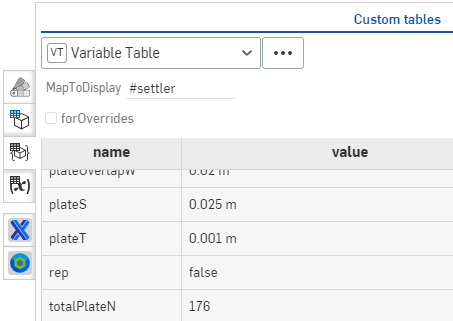

.. raw:: html

    <embed>
       <link rel="canonical" href="https://aguaclara.github.io/Textbook/Clarification/Clarifier_Design_Challenge.html" />
       
    </embed>

.. _title_Clarification_Design_Challenge:

******************************
Clarification Design Challenge
******************************

Designing a clarifier requires selecting several key design parameters. The floc filter upflow velocity sets the plan view area of the clarifier and thus directly controls the cost of the concrete tank. The capture velocity sets the required area of the plate settlers and thus sets their cost. The maximum velocity gradient sets the maximum velocity exiting the diffuser ports and that in turn sets the maximum velocity in the inlet manifold and hence the diameter of the inlet manifold.

If your instructor has not provided you with a link to the starting document, use the part studio in your copy of the `Clarifier Template <https://cad.onshape.com/documents/37c3642d5566cf6b172fe9ad/w/99df7cb12d54d9a652b7d74e/e/99b313b3d094d5a33a5f0cc9?configuration=G_max%3D140.0%3BQm_max%3D6.0%3BTEMP_min%3D5.0%3BcaptureVm%3D0.12%3Bip%3DAPP%3BplateAN%3D60.0%3BplateS%3D0.025%3Brep%3Dfalse%3BupVm%3D1.0&renderMode=0&uiState=640cb6f5fb8efc495ca8914b>`_. The design can be modified directly by editing the configuration inputs in the part studio. The Design Analysis feature studio is where you can do calculations and answer the questions.

Learning Objectives
===================

* Play with the design and then reflecting on how the underlying physics is controlling the resulting design.
* Make the connections between raw water characteristics, flocculator design, and clarifier design.
* Learn the power of combining the constraints imposed by physics with the cost of materials to guide the design.

Playful Reflections
===================

Use the full `Clarifier <https://cad.onshape.com/documents/e05915c533ee7568c402981a/v/a0389db9934abd3b972edf52/e/3f94eabd115787bc33ae755d?configuration=G_max%3D230.0%3BQm_max%3D12.0%3BShow_Internal_Components%3Dtrue%3BTEMP_min%3D5.0%3BcaptureVm%3D0.12%3BdividingWalls%3Dtrue%3BffWasteBottom%3Dtrue%3Bip%3DAPP%3BplateAN%3D60.0%3BplateS%3D0.025%3Brep%3Dfalse%3BrepBay%3Dfalse%3BslopeWeirS%3D0.2%2Bmeter%3Bspare%3D0.0%3BupVm%3D1.0&renderMode=0&uiState=65fcb6f9c5a5a03414367526>`_ to answer the questions in the reflections function of the Clarifier Template. Use the defaults as provided in the link above and return to the link if you forget the defaults. Write the answers to these questions in the function reflections of the Clarifier Template.

    #. What do you initially think will happen to the total cost of the 0.8 mm polycarbonate sheets used for plate settlers if you were to increase the spacing of the plate settlers? There are no wrong answers here! The cost info is in the Bill of Materials in the custom tables.
    #. Vary the plate settler spacing from 1 cm to 5 cm and observe the cost of the 0.8 mm polycarbonate sheets. What do you observe and is it what you expected?
    #. Write a sentence or two to explain what you observed based on the underlying physics of the plate settlers. Remember that it is on the projected area (horizontal area) that particles can settle out. Refer to Equation :eq:`vc_of_vz_plate` (see `textbook <https://aguaclara.github.io/Textbook/Clarification/Clarifier_Derivations.html#equation-vc-of-vz-plate>`_) and also consider how the number of plate settlers changes as you vary the spacing.
    #. Why does the depth of the clarifier change when the plate settler spacing is changed? Watch the change in design carefully to see exactly which dimensions change.
    #. Reset the plate settler spacing to 2.5 cm. Now play with the plate settler angle. We haven't done any research on this parameter and different manufactures of plate settlers use slightly different angles. How much would the clarifier cost decrease if we decreased the plate settler angle from 60° to 55°?
    #. Reset the plate settler angle to 60 deg. Identify at least 3 changes in the design as you decrease the flow from 12 L/s to 1 L/s.
    #. Reset the flow rate to 12 L/s. What happens if you increase the floc filter velocity to 1.5 mm/s? Identify at least 2 changes and explain why those changes occurred.

Design Exploration
==================

This part of the design exploration focuses on the plastic components that fit inside each of the bays in a clarifier. If your instructor has not provided you with a link to the starting document, use the part studio in your copy of the `Clarifier Template <https://cad.onshape.com/documents/37c3642d5566cf6b172fe9ad/w/99df7cb12d54d9a652b7d74e/e/99b313b3d094d5a33a5f0cc9?configuration=G_max%3D140.0%3BQm_max%3D6.0%3BTEMP_min%3D5.0%3BcaptureVm%3D0.12%3Bip%3DAPP%3BplateAN%3D60.0%3BplateS%3D0.025%3Brep%3Dfalse%3BupVm%3D1.0&renderMode=0&uiState=640cb6f5fb8efc495ca8914b>`_ for this part of the assignment.

The rendering time for the design is significantly faster if replicate parts is set to false. When replicate parts is false the part studio only shows single parts in most cases. Although all of the replicated parts aren't shown, the cost calculations are still correct. You can verify this by setting replicate parts to true and then check to see if the Bill of Materials is the same.

Use the following values as the defaults for this design.

* design the components for Agua Para el Pueblo (APP).
* flowrate = 12 L/s
* maximum velocity gradient (in the inlet manifold and jet reverser) = 230 1/s
* minimum temperature = 5°C
* upflow velocity (at the top of the floc filter) of 1 mm/s
* plate settler capture velocity of 0.12 mm/s
* plate settler angle = 60°

Remember that the number of clarifier bays changes as you change the flow rate and for a 12 L/s flow there would be two bays.

In this design challenge, the parameter list is not included explicitly in the Design Analysis FeatureScript tab, so to check the value or name of a variable you can use the Variable Table.

You can use the Variable Table in the custom tables to browse the map of design variables.
With MapToDisplay empty, you can see all of the top level entries in the design map. To browse deeper in the map enter # followed by the name of the variable that you want to explore.

.. _figure_VariableTable:

.. figure:: ../Images/VariableTable1.png
    :height: 300px
    :align: center
    :alt: Custom variable table.

    Browsing the top level variable of the design map.

To browse the map of settler, simply type #settler in the MapToDisplay.

.. _figure_VariableTable2:

    Browsing the next level deeper of the design map.

To browse further simply append the name of the next variable using dot notation (for example #settler.module.pipe).

Answer the following questions.

#. What is the total cost of the plastic for the default design? Use the Bill of Material and simply copy the total cost and paste it into your answer. It would be cool to make a cost function that could be called in FeatureScript for a part studio that would make it easy to change inputs and compare costs, but we don't have that figured out yet!
#. What are the two most expensive line items in the bill of materials?
#. How many plate settlers are in this clarifier bay? You can browse the design map using the custom Variable Table (in the same location as the Bill of Materials). Make sure to find the total number of plates in the bay rather than the number of plates in a plate module.
#. What is the flow rate between two plates? Note that the number of spaces between plates is one less than the number of plates!
#. What is the plan view area of the entrance into the space between two plate settlers? We will use this to calculate the vertical component of the velocity entering the plate settlers.
#. What is the vertical velocity entering the plate settlers? You'll need to use continuity to figure this out.
#. Why is this vertical velocity entering the plate settlers greater than the floc filter upflow velocity in the clarifier in the section where the walls are vertical? You can look at the side view of the clarifier to understand why the water has to speed up when it transitions from the top of the floc filter to the plate settlers.
#. We will check how close the design is to the specifications that were given initially. What is the capture velocity of these plate settlers (see Equation :eq:`vc_of_vz_plate` or see `textbook <https://aguaclara.github.io/Textbook/Clarification/Clarifier_Derivations.html#equation-vc-of-vz-plate>`_)?
#. Is the calculated capture velocity better than or worse than the design capture velocity?
