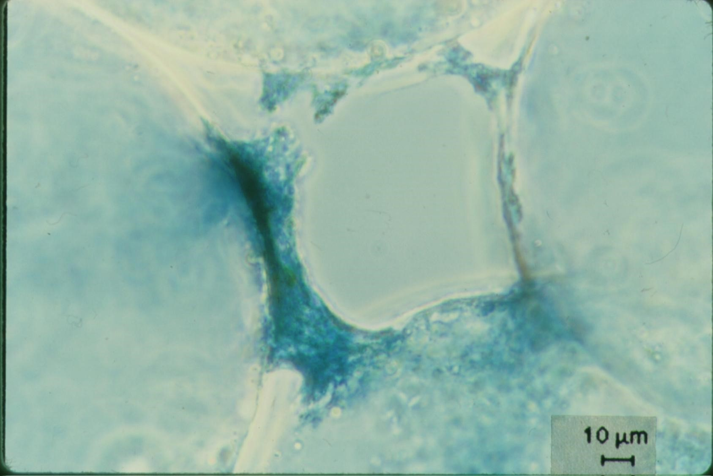
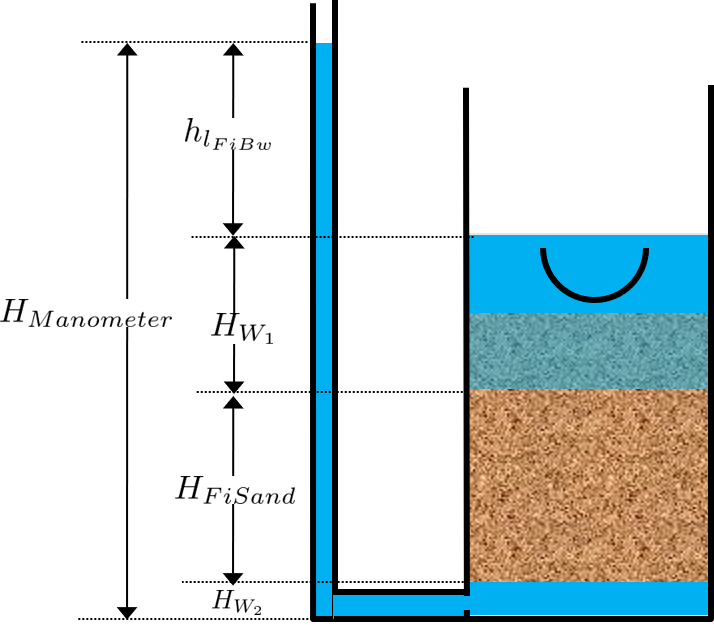
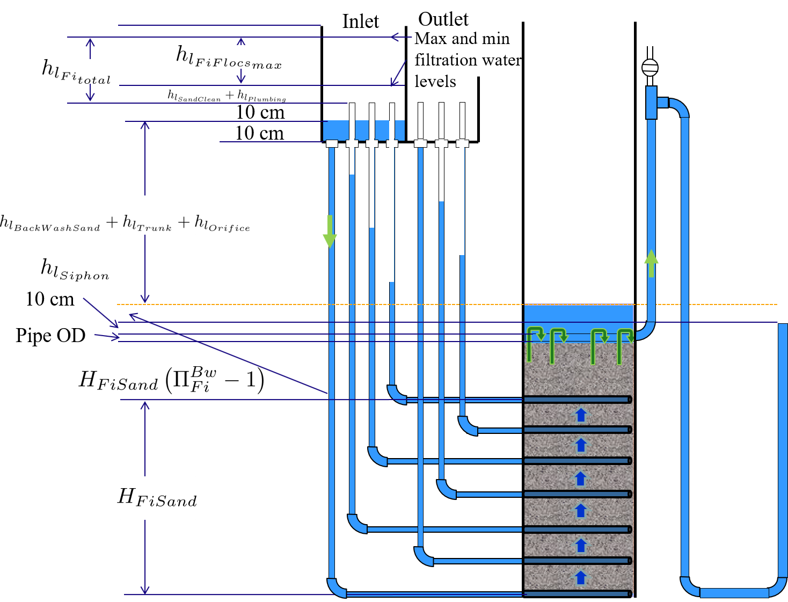

.. raw:: html

    <embed>
       <link rel="canonical" href="https://aguaclara.github.io/Textbook/Filtration/Filtration_Intro.html" />
       
    </embed>

.. _title_Filtration_Introduction:

************************
Filtration  Introduction
************************

"If the water is dirty, then filter it." That is a common misunderstanding of what we should do if the water is dirty. And that misunderstanding has led to many, many failures of water treatment technologies. There are slow sand filters and multistage filters abandoned in many corners of Honduras. The first AguaClara plant at Marcala, Honduras was built in an abandoned filtration plant. In many cases the failed filters were installed in locations where the raw water carried far too much sediment to be treated by filtration. This common misunderstanding of the capabilities of sand filters has a long history.

.. _figure_Abandoned_Filtration_Plant:

.. figure:: ../Images/Abandoned_Filtration_Plant.jpg
    :width: 300px
    :align: center
    :alt: photomicrograph

    Abandoned multiple stage filtration plant in the valley north of Tegucigalpa, Honduras.

History of Filtration
======================

Starting in 1829 surface water treatment plants in England used slow sand filters. Decades later in 1885 they discovered that slow sand filters actually remove bacteria. That was quite a surprise given that the pores in slow sand filters are perhaps 50 times larger than the bacteria that they remove! Clearly filters were doing something more interesting than simply straining out particles that were bigger than the pores.

.. _figure_glass_beads_and_flow_constriction:

    Sample taken from the top of a slow sand filter made with glass beads. Note the constriction that is building in the narrowest part of the void between 4 glass beads.

Slow sand filtration ran into big trouble when they were installed in cities along the Ohio and Mississippi Rivers in the United States. The high sediment load carried by those rivers could not be removed using slow sand filters. The need to treat water with high sediment loads (high turbidities) led to the innovation of coupling flocculation, sedimentation, and a new kind of filter - rapid sand filters. The early emphasis on filtration as the primary process persisted and continues even today. For example, the surface water treatment plant that provides drinking water to the Cornell University campus is called Cornell Water Filtration Plant.

The process that removes most of the particles in the Cornell Water Filtration Plant is the clarifier with big assistance from the flocculators. The rapid sand filters are a polishing step that removes approximately 1 NTU or about 1 mg/L of solids. This is not to diminish the importance of filtration. After all, this chapter is all about filtration. The goal is to put filtration in context and remind all of us that both slow and rapid sand filters are limited to polishing water that is already very clean.

Slow Sand Filters
-----------------

Slow sand filters don't use coagulants or pretreatment. They are suited for surface waters coming from pristine watersheds. They are a passive technology in that there is no way for an operator to improve performance other than to clean the filter.

Slow sand filters are sometimes called bio filters, a misunderstanding that has persisted from the early observations that biofilms grow (or are imported) in the sand bed. Although biofilms do form in slow sand filters it is unlikely that they play a role in particle removal. Weber-Shirk demonstrated that removal of E. coli by slow sand filters was insignificant even when the filters had 1 m of head loss due to biofilm growth. Weber-Shirk also demonstrated that slow sand filters perform well even when poisoned with azide. Weber-Shirk also demonstrated that predation by a small protozoan, a chrysophyte, can play a role in the removal of bacteria. The chrysophyte is too small to ingest protozoan pathogens such as cryptosporidium or Giardia lamblia and thus those organisms are likely only removed by physical-chemical means. Similarly it is unlikely that the chrysophyte wastes energy on ingesting virus particles. The dominant particle removal mechanism in slow sand filters is physical-chemical and is the same mechanisms at work in rapid sand filters. Naturally occurring aluminum creates sticky surfaces in the sand bed and makes some of the influent particles sticky. It is likely that aluminum content in the raw water plays a significant role in slow sand filter performance. The aluminum hydroxide nanoparticle "glue" is likely able to effect the removal of a wide range of particle sizes.

Slow sand filters remove the majority of the particles in the top cm of the sand bed. A schmutzdecke (filter cake or layer of dirt) generally forms on top of the sand and this layer of dirt causes the majority of the head loss through the filter bed. It is this thin layer that is removed when the head loss is too high to achieve the desired flow rate through the filter. Most slow sand filters are cleaned by hand using shovels to remove a thin layer of the schmutzdecke. The cleaning process is labor intensive and requires taking the filter offline for a day or longer.

.. _figure_SSF_at_Jesus_de_Otoro:

.. figure:: ../Images/SSF_at_Jesus_de_Otoro.jpg
    :width: 400px
    :align: center
    :alt: filter set

    Slow sand filters at Jesus de Otoro, Honduras. Slow sand filters require extensive areas of flat terrain or extensive earthwork to create a level spot. In the tropics the filters are open to the sky and that results in nuisance growth of algae. In climates where freezing is a problem the filters are covered.

Multistage Filters
------------------

Multistage filters were invented to extend the range of applicability of slow sand filters. Slow sand filters were viewed as an appropriate technology for rural communities, but their very limited ability to treat water with suspended solids made them inappropriate for communities that have surface water sources with high turbidity during runoff events. Roughing filters made with various sizes of gravel were added to remove sediment. The roughing filters were essentially inefficient clarifiers with 60% of their volume occupied by rocks! Roughing filters were also difficult to clean and without using coagulants their particle removal efficiency was poor. Nonetheless, multistage filters have been built in many rural communities in Latin America.

Rapid Sand Filters
------------------

It is always interesting to try to understand why different technologies were invented and specifically what problem they were trying to solve. One possibility is that the goal was to reduce the labor required for cleaning slow sand filters by devising a system to clean the sand in place. Given the idea of fluidizing the bed of sand with a high upflow velocity it then became tempting to evolve to higher flow rates during filtration because having to clean the filter frequently was no longer a problem. Another possibility is that rapid sand filters were invented to handle higher turbidity water, but that isn't supported by the capabilities of rapid sand filters. Slow and rapid sand filters have very similar maximum influent water turbidity limits. Thus the real advantage to rapid sand filters is that they can be cleaned quickly.

Many rapid sand filters use 2 or 3 different densities and sizes of filter media to achieve a system with large pores at the surface of the filter and smaller pores deeper within the filter. If sand with a wide range of sizes is fluidized, the small sand grains quickly rise to the top and the large sand grains fall to the bottom. Thus a poorly sieved sand will have small pores at the top and large pores at the bottom after backwash. The trick to creating a mix of filter media that results in big pores on the top is to use low density, large diameter media with a lower terminal velocity rather than a higher density, small diameter media. During backwash the less dense media ends up on top and thus this reverse stratification is achieved.

Given that many installed rapid sand filters are dual media it is worth reflecting on what problem the dual media filters are designed to solve. One possible problem is surface clogging of the sand filter when large, strong flocs bridge across sand pores and then support a layer of flocs above the sand bed. This surface layer would be similar to the schmutzdecke in slow sand filters and could be the location of significant head loss. It appears that rapid sand filters do suffer from surface clogging in some instances. Of course, it is possible that this failure is related to the use of flocculent aids that result in excessively strong flocs and/or clarifiers that don't effectively capture large flocs.

Additional potential benefits of dual media filtration include the possibility that they can hold a larger mass of particles before requiring backwash or that they may be able to achieve higher particle removal efficiency. `Zouboulis et al. <https://doi.org/10.1016/j.desal.2006.02.102>`_ compared single and dual media filtration and demonstrated that the main advantage to dual media filtration was that it had a lower rate of head loss accumulation. Given that the rate of increase of head loss for the dual media filters was constant over time, this suggests that the pores that were doing the filtration were exclusively in the larger of the two media. This suggests that larger diameter media (rather than dual media) might be a better choice for rapid sand filters.

Dual media filters face more challenges during cleaning. The use of relatively low density media for the top layer results in a lower density fluidized bed. This lower density fluidized bed makes it possible for flocs to form mudballs that are sufficiently dense to fall through the top layer of media during backwash (page 221 of Water and Wastewater Technology, 6th edition, by Hammer and Hammer, 2008). The formation of these mudballs is one of the reasons that dual media filters use air scour before or during backwash to breakup the mudballs.

The addition of flocculation and sedimentation prior to filtration changes the properties of the incoming particles. The settled water contains small flocs and primary particles with some coagulant nanoparticles attached. These particles are sticky and the stickiness undoubtedly influences the physics of the particle attachment processes inside the sand bed. We will talk more about the mysteries of life inside a filter bed later in this chapter.

Rapid sand filters rely on a backwash system.  It takes a relatively high velocity of water to fluidize a bed of sand and that water has to come from somewhere. In conventional water treatment plants that water comes from a clearwell that is filled with filtered water. During backwash water from the clearwell is pumped through the filter and then either wasted or returned to the head of the plant for another pass through the treatment processes. The need for pumps is one of the big disadvantages of conventional rapid sand filters. Conventional rapid sand filters fail if they lose power or if there isn't enough filtered water in the clearwell when the filter needs to be backwashed. This raises an interesting question about how rapid sand filters are initially commissioned at water treatment plants given that the clearwell is initially empty and given that filters must be filled with water from the bottom. If you dump water on top of a dry filter bed the water will create a few paths down through the sand and the majority of the sand pores will remain filled with air even when the level of water floods the top of the filter bed. Thus the first operation in rapid sand filter startup must be backwash!

One solution for eliminating the need for backwash pumps is to design a set of filters that work together to backwash one of the filters. This eliminates the need for a clearwell for backwash water. This system of a set of filters is used by `CEPIS <http://cepis.org.pe/sobre-el-cepis/>`_ in their design of `rapid sand filters <../_static/references/CEPIS/CEPIS5_Batería_de_filtros.pdf>`_ This system is an elegant solution that works well for small cities, but the requirement of 6 filters is onerous for towns where 2 filters should have been sufficient.

.. _figure_CEPIS_filter_set:

.. figure:: ../Images/CEPIS_filter_set.jpg
    :width: 300px
    :align: center
    :alt: filter set

    6 filters form a complete set such that 5 filters can work together to backwash one filter without using pumps.

Stacked Rapid Sand Filters
--------------------------

Stacked Rapid Sand, StaRS, filters were invented in 2010 by the AguaClara Cornell program in response to the need for a new technology that would both eliminate the need for backwash pumps AND not require the construction of 6 filters for small towns. StaRS filters use 6 20 cm deep layers of sand (no dual media here) with the layers stacked vertically. The six layers give a total sand depth of 1.2 m. The filter operates with the same design flow rate for both backwash and filtration modes and uses settled water for backwash. This eliminates the startup problem for rapid sand filters that don't have an initial source of backwash water. The shallow filter layers take advantage of new insights into the filtration mechanisms (more on that soon).

StaRS filters come in two configuration parameters. Open StaRS (OStaRS) are used for flow rates greater than about 8 L/s. An 8 L/s filter has a plan view area of 85 cm x 85 cm. This is considered the minimum size that can be constructed with a human working inside the filter. For lower flow rates, Enclosed StaRS (EStaRS) filters can be assembled using PVC pipe as the body of the filter. The inner plumbing can be accessed through openings in the top and bottom of the main filter body.

`See this Colab worksheet for determining the filter width for a specific flow rate <https://colab.research.google.com/drive/15IrqdHgnk3NZVTiIuhQc6YdwFgquIHD1#scrollTo=xAc_E3A85-ai&line=1&uniqifier=1>`_

.. _table_Net_Velocities:

.. csv-table:: Relative velocities and areas for different unit processes.
   :header: Filter Type, Velocity (mm/s), Cleaning (mm/s), Max (NTU), pC*, Area :math:`(m^2)` for 1 L/s
   :widths: 20, 20, 20, 20, 20, 20
   :align: left

   Dynamic, 0.4, , , 0, 2.5
   Roughing, 0.17, 5.5 mm/s downflow, , 0.5, 5.9
   Slow, 0.04, Scrape surface, 10, 0.8, 25
   Multistage,0.03, , 100, 1.3, 33.4
   Rapid, 0.7 - 2.8, 11 mm/s backwash, 5, 1, 0.55
   AC Entrance, 8, , , , 0.125
   AC Flocculation, 4, , , , 0.25
   AC Clarification, 1, , , 2.5, 1
   AC Floc Hopper, 5, , , ,0.2
   AC Stacked Rapid, 1.8*6,11 mm/s backwash,3,1,0.093
   AC total, 0.6, , 1000, 3.5, 1.67

The slowest (and hence largest) unit process in the AguaClara surface water treatment train is clarification. Thus clarifiers represents the most likely opportunity for significant cost reduction. The entire AguaClara treatment train is a fraction of the size of the dynamic filters that are used in multiple stage filtration plants.

Filters remove the least amount of contaminants in a surface water treatment plant.

Filters have a huge range in velocities that correspond to a huge range in size. This is illustrated in the city of Jesus de Otoro, Honduras. They have both a 20 L/s multiple stage filtration plant and a 20 L/s AguaClara plant serving different sections of the city. The plants can both be seen in `Google Maps <https://www.google.com/maps/d/u/0/viewer?mid=1Rjl2cfjMn0Pk7E11KVq9A1mlj2Q&ll=14.491993514824715%2C-87.97505904373156&z=16>`_.

.. _figure_Size_of_Jesus_de_Otoro_Plants:

.. figure:: ../Images/Size_of_Jesus_de_Otoro_Plants.png
    :width: 400px
    :align: center
    :alt: filter set

    Two water treatment plants using different technologies and serving the same city illustrate the high construction cost of low technologies simply based on the required size of the low tech facilities.

.. _heading_porosity:

Porosity
========

Porosity of a sand bed refers to the ratio of the void volume to the total volume of the sand bed.

.. math::
  :label: porosity

   \phi_{FiSand} = \frac{\forall_{voids}}{\forall_{total}}

Porosity is determined by the geometry of the material and the size distribution (or uniformity of the particle sizes) and not by the average size of the particles. If you have three different sized spheres (such as  1 um clay, 0.2 mm sand, and 1 cm gravel) in three different buckets, each bucket will have the same porosity as seen in :numref:`figure_porosity`. To minimize the porosity, the three materials could be mixed because the smaller materials would be filling the pore space of the larger material.

.. _figure_porosity:

.. figure:: ../Images/figure_porosity.png
    :align: center
    :alt: This figure illustrates how different sized materials have the same total bulk porosity

    Within each box, the spheres are different sizes. However the total porosity is the same. To minimize the pore space, the smaller particles could be used to fill the spore space between the larger particles, though in a filter this is not necessarily ideal.

One way that the relative size of particles is characterized is by describing the size of the smallest 10% of grains, and the smallest 60% of grains. That is:

:math:`D_{10}` = the sieve size that passes 10% by mass of sand through

:math:`D_{60}` = the sieve size that passes 60% by mass of sand through

:math:`D_{10}` is used for particle removal models, and :math:`D_{60}` is used for hydraulic modeling.

The ratio of the two is the uniformity coefficient:

.. math::
  :label: uniformity_coefficient

    UC = \frac{D_{60}}{D_{10}}

The uniformity coefficient describes the uniformity of the sand. A :math:`UC = 1` indicates that every grain of sand is the same size, which is the ideal case. A large :math:`UC` is indicative of a wide range of grain sizes which will result in stratification of the sand bed after backwash with fine sand on top. This will result in more rapid development of head loss during filtration. The fine sand on top will also expand more during backwash and could result in loss of sand during backwash.

During backwash, the sand is fluidized and the sand bed expands. This expansion causes a change in porosity of the sand bed (as the volume of water occupied by the sand is increased). The porosity and height of the sand bed are directly related through the following equation:

.. math::
  :label: backwash_porosity

   \phi_{FiSandBw} = \frac{\phi_{FiSand} H_{FiSand} A_{Fi} + \left( H_{FiSandBw} - H_{FiSand} \right) A_{Fi}}{H_{FiSandBw} A_{Fi}}

| Such that:
| :math:`\phi_{FiSandBw}` = sand porosity during backwash
| :math:`\phi_{FiSand}` = settled sand porosity
| :math:`H_{FiSand}` = height of sand in the filter
| :math:`H_{FiSandBw}` = height of sand during backwash
| :math:`A_{Fi}` = filter area

From this it becomes possible to directly relate porosity (as above) to the filter expansion ratio, which is simply the ratio of the heights of the expanded sand bed and the settled sand bed:

.. math::
  :label: filter_expansion_ratio

  H_{FiSandBw} = \Pi_{Fi}^{Bw} H_{FiSand}

| Such that:
| :math:`\Pi_{Fi}^{Bw}` = the expansion ratio value
| :math:`H_{FiSand}` = height of sand in the filter
| :math:`H_{FiSandBw}` = height of sand during backwash

.. _CLean_Sand_Head_loss:

Clean Bed Head Loss
====================

The Carman Kozeny Equation, an adaptation of the Hagen-Poiseuille Equation :eq:`` describes the head loss through a clean bed during filtration. The Ergun Equation :eq:`eq_Ergun` can also be used to estimate head loss in porous media.

.. math::
  :label: eq_Carman_Kozeny

   \frac{h_l}{H_{FiSand}} = 36 k \frac{\left( 1 - \phi_{FiSand} \right)^2}{\phi_{FiSand}^3} \frac{\nu \bar v_a}{g D_{60}^2}

| where
| :math:`h_l` = head loss in sand bed
| :math:`H_{FiSand}` = the sand bed depth/length of flow paths
| :math:`\phi_{FiSand}` = porosity of sand
| :math:`\nu` = kinematic viscosity
| :math:`\bar v_a` = the approach velocity (the velocity the water would have if the filter didn't have any sand!)
| :math:`D_{60}` = the size of the sand
| :math:`g` = gravity
| :math:`k` = Kozeny constant (5 for most filtration cases)

This equation is valid for Reynolds numbers less than 6. Where:
:math:`{\rm Re}  = \frac{D_{60} \bar v_a}{\nu}`

.. _backwash_head_loss_force_balance:

Backwash Head Loss
==================

To determine the head loss during backwash a force balance can be performed between the water and the sand per unit of filter area (see :numref:`figure_force_balance`).

.. _figure_force_balance:

    The pressure required to hold up the fluidized sand must equal the pressure in the manometer.

The pressure from the water in the manometer:

.. math::

  P_{Manometer} = \rho_{Water} g \left( H_{W_1} + H_{W_2} + \phi_{FiSand} H_{FiSand} \right) + \rho_{Sand} g \left( 1 - \phi_{FiSand} \right) H_{FiSand}

| Such that:
| :math:`P_{Manometer} =` total height from the bottom of the filter to the inlet box
| :math:`\rho_{Water} =` density of water
| :math:`H_{W_1} =` the distnace from the top of the settled sand bed to the water surface in the filter
| :math:`H_{W_2} =` the height of the water below the sand bed but within the filter
| :math:`\phi_{FiSand} =` porosity of sand
| :math:`H_{FiSand} =` height of the filter bed
| :math:`\rho_{Sand} =` density of sand

The pressure from the sand and water in the filter:

.. math::
  P_{Manometer} = \rho_{Water} g \left( H_{W_1} + H_{W_2} + H_{FiSand} + h_{l_{FiBw}} \right)

| Such that:
| :math:`h_{l_{FiBw}} =` the difference in height of the inlet and water surface height during backwash; the backwash head loss

Setting them equal for a force balance:

.. math::

  \rho_{Water} g \left( H_{W_1} + H_{W_2} + \phi_{FiSand} H_{FiSand} \right) + \rho_{Sand} g \left( 1 - \phi_{FiSand} \right) H_{FiSand} = \rho_{Water} g \left( H_{W_1} + H_{W_2} + H_{FiSand} + h_{l_{FiBw}} \right)

Which simplifies to:

.. math::
  :label: headloss_bw_sand

  h_{l_{FiBw}} = H_{FiSand} \left( 1 - \phi_{FiSand} \right)  \left( \frac{\rho_{Sand}}{\rho_{Water}} - 1 \right)

This result gives a ratio of the head loss during backwash to the height difference during forward operation. With :math:`\phi_{FiSand} = 0.4` and :math:`\rho_{Sand} = 2650 kg/m^3` the value of this ratio is:

.. math::
  :label: eq_Min_Fluidization_Velocity

  \left( 1- \Phi_{FiSand} \right) \left( \frac{\rho_{FiSand}}{\rho_{Water}} - 1 \right) = 0.99

Minimum Fluidization Velocity
=============================

The minimum fluidization velocity for a sand bed can be obtained by setting the head loss through the sand (Equation :eq:`eq_Carman_Kozeny`) equal to the head required to suspend the sand bed (Equation :eq:`eq_Min_Fluidization_Velocity`).

Using these two equations the minimum velocity for sand fluidization can be found.

.. math::
  :label: minimum_fluidization_velocity_sand

  \bar v_{MinFluidization} = \frac{\phi_{FiSand}^3 g D_{60}^2}{36 k \nu \left( 1 - \phi_{FiSand} \right)} \left( \frac{\rho_{Sand}}{\rho_{Water}} - 1 \right)

From this equation it can easily be seen that if the diameter of the sand at the top is half the diameter of the sand at the bottom, it will fluidize at one quarter the velocity. This result indicates that fluidization occurring at the top of the filter does **not** imply that the sand at the bottom of the filter is fluidized.

Filter Box Depth
================

The full design for the filter dimensions can be found in the `Onshape Filter OStaRS <https://cad.onshape.com/documents/df017cf84042956843b898b5/w/5ea2e02b2dec2f39a7907b9c/e/14720b8e836529543a668762>`_. The full design requires detailed calculations that include trunk, siphon, and branch dimensions, pipe head loss during backwash, sand expansion, as well as the head loss through the sand during both backwash and filtration.

.. _figure_filter_water_levels_bw:

    The water levels in the filter during backwash show the required depth for the filter box.

A simplified estimate of the filter box depth can be obtained that neglects the smaller details to illustrate the major contributors to the filter depth. The depth of sand in the filter, :math:`H_{FiSand}` is approximately

.. math::
  :label: sand_depth

  H_{FiSand} = N_{layer} H_{layer}

where :math:`N_{layer}` is the number of filters in the stacked filter and :math:`H_{layer}` is the height of one filter layer and the center to center distance of the filter trunks. The height of the sand when it is fluidized during backwash is given by

.. math::
  :label: bw_sand_depth

  H_{sand_{bw}} = \Pi_{Fi}^{Bw} H_{FiSand}

where :math:`\Pi_{Fi}^{Bw}` is the depth of the fluidized bed during backwash normalized by the sand bed depth.

The head loss through silica sand (with density of :math:`2650 \frac{kg}{m^3}`) during backwash is approximated as (see Equation :eq:`headloss_bw_sand`)

.. math::
  :label: approximate_bw_HL

  h_{l_{FiBw}} = H_{FiSand}

The approximate height of the water in the filter box at the end of a filter run is thus

.. math::
  :label:

  HW_{Fi_{max}} = h_{l_{FiBw}} + H_{sand_{bw}} + h_{l_{FiSand_{max}}}

Substituting Equations :eq:`approximate_bw_HL`, :eq:`bw_sand_depth`, and :eq:`sand_depth` we obtain an estimate of the depth of an open stacked rapid sand filter.

.. math::
  :label: approximate_filter_depth

  HW_{Fi_{max}} = N_{layer} H_{layer}(1+\Pi_{Fi}^{Bw}) + h_{l_{FiSand_{max}}}

This estimate of the depth of water in the filter box does not include all of the factors and is an underestimate of the actual value used in design.
