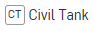

.. raw:: html

    <embed>
       <link rel="canonical" href="https://aguaclara.github.io/Textbook/Flow_Control_and_Measurement/ET_Design_Challenge.html" />
       
    </embed>

.. _title_Entrance_Tank_Design_Challenge:

******************************
Entrance Tank Design Challenge
******************************

AguaClara Reach is creating the AguaClara Infrastructure Design Engine (AIDE) so that they can provide customized designs of drinking water treatment plants for implementation partners. Conventional design approaches would take months of engineering time to create a water treatment plant design for a community. AIDE makes it possible to change the design inputs and generate a new design in a matter of minutes (or seconds). AIDE makes it possible to mass produce customized designs.

This design challenge is to create a slightly simplified version of an `entrance tank <https://cad.onshape.com/documents/4c47a124da3abec33e0ce813/w/3955cd0d266daedd3eabf165/e/bcf152c5be02d9ab5b2b5285?renderMode=0&uiState=63bed8e9b21e0705e88efcae>`_ for a water treatment plant.

Assignment Logistics
====================

* The ideal learning method is to do all of the steps of this assignment yourself while working with your teammates to help each other quickly learn the steps.
* Collaborate with your classmates and TA to learn and complete all of these steps efficiently
* Work together to polish one of the documents that you and your teammates have created for submission.

You will learn how to:
======================

* perform a series of design steps in FeatureScript
* connect design results to a 3-D geometric model
* use existing functions to connect client needs to the design of a system
* enter params that set minimum, default, and maximum values for inputs
* access AguaClara functions to calculate the diameter of a pipe
* see the results of your calculations in the variable table and in a 3-D model of the entrance tank

SetUp
=====

Set up your Onshape workspace so that you have access to the following custom features created by AguaClara.

.. _figure_addCustomFeature:

.. figure:: ../Images/add_custom_features.png
    :height: 300px
    :align: center
    :alt: Custom variable table.

    Add custom features to the feature menu.

Copy the document path below and paste it into the search box for adding custom features to quickly find each feature.

#. Civil Tank: inside Core Parts open up tanks and select Civil Tank (cad.onshape.com/documents/c0af0d6b5703e7a8fb53f53f)
#. Overflow Pipe: select overflow.fs and then select Overflow Pipe (cad.onshape.com/documents/50136809eb4dab5feb113036)
#. Embed: select Embed.fs (cad.onshape.com/documents/c35baaea9a3ba0044a66bc94)

When you have completed these steps all of these features should show up in your custom feature menu.

#.  |civilTank|
#.  |overflowPipe|
#.  |EMBED|

AIDE Feature Studios
====================

The Feature Studio is where we can do the calculations for the design of the parts that we are making in the Part Studio. AIDE Feature Studios have 3 main sections.

* Tree - where we define the function calls (designers) and input parameters (params) required for the design. In more complex designs the Tree is also used to define the connections with parts that are children or subcomponents.
* Designer - where we calculate the dimensions of the part we are designing. The variables that we define are all part of the design map and can be accessed as :code:`design.varName`. Thus the length of a part would be defined as :code:`design.L`.
* Feature - this is the code that inserts the results of our calculations (the design map) into the part studio. This feature is inserted as the very first feature in the part studio so that all of the subsequent features have access to the  variables in the design map.

Units in AIDE
=============

Engineering design calculations should always be done using software tools that support units. Units provide an import check on all calculations and using units ensures that the we don't burn up our spacecraft because of a failure to use the right units in an equation. In Onshape all of our calculations include units. Unfortunately there is a limitation on how we pass parameters from one component to another component as we create complex designs with multiple components. To get around this limitation we have adopted a strict `variable naming convention <https://cad.onshape.com/documents/7e7bfd441e81a4b207bb9b86/w/36fcd65eb9f3ae9f72ccf937/e/9c67513c34ba306ef874295f>`_ so that we know what units a variable has just from looking at its name. Here are a couple examples of variable names, their units [] and an evaluation of whether or not they meet our requirements.

* :code:`myFavorityDimensionIsL` [meter] YES!
* :code:`V_MAX` [oops] NO! subscripts must be lower case - should be :code:`V_max`
* :code:`riverQ` [meter^3/s] YES!
* :code:`riverQm` [L/s] YES! The m really means milli (m^3/s) which is the same as L/s.
* :code:`pipeWallS` [meter] YES! This is the Space between a pipe and a wall

Hydraulic functions
===================

AguaClara has added a limited number of hydraulic-related functions in FeatureScript in `AguaClara Core FS <https://cad.onshape.com/documents/6750b53736b16374e515f93d/w/e1f0d6546c0ebff38956e2f7/e/397556f7ec0f2b14bcbdc049>`_. The most commonly used functions for this course are in the tabs headloss and physical chemistry. The pipe design equations that work for both laminar and turbulent flow regimes are found in those two tabs. For example the function

* :code:`flowPipe (diam, headloss, length, nu, roughness, kMinor)`  will calculate the flow rate in a given pipe given the available energy (head loss).
* The companion function to calculate the minimum required pipe diameter given a desired flow rate is :code:`diamPipe(flowRate, head loss, length, nu, pipeRough, kMinor)`
* The actual head loss given a pipe and a flow rate is :code:`pipeHeadloss(flowRate, diam, length, nu, pipeRough, kMinor)`
* The density and viscosity of water are available as functions of temperature in the physical chemistry tab.

You can access these functions quickly while editing in featurescript by typing the part of the function name that you remember and Onshape will provide a list of possible functions for you to select from.

Entrance Tank Design
====================

An AguaClara entrance tank performs the following functions:

#. removes trash with a trash rack (leaves, twigs, litter) to prevent clogging of the inlet diffusers in the sedimentation tank
#. removes grit by sedimentation
#. dumps water that exceeds the design flow rate of the plant
#. measures the flow into the plant
#. water level in the entrance tank is used to set the flow of coagulant and chlorine.
#. coagulant is injected at the outlet of the entrance tank

For this design challenge we will do a simplified design to remove grit and dump excess water.

Part 1: Feature Studio Steps
============================

**If your instructor has not provided you with a link to the starting document**, you can create a copy of the `Entrance Tank Template <https://cad.onshape.com/documents/9f328e7469cf14badb5e3dc7/w/4685a40508e8c33569b72627/e/bf3d6bc51cf7511178df36b4>`_.
Name the file "[your team name] Entrance Tank".

Follow each step as described in the Entrance Tank.fs for problems 1-11.
------------------------------------------------------------------------

Open the tab Entrance Tank.fs. You will see commented out blue directions for the code that you need to create. This is the core of the coding part of this challenge!

Check that each line of your code works before proceeding to the next step. Monitor FeatureScript Notices to make sure no warnings or errors are being reported. FeatureScript Notices will also show your printed answers as you are working if you select Monitoring Entrance Tank PS in the upper right of the FeatureScript window.

NOTE: Question 3 in the FeatureScript mentions using either an if statement or a min/max function, we recommend using the min/max function!

A few hints for FeatureScript
* almost all lines of code end in a semicolon;
* new variables that are part of the design map can be defined like this example: design.planViewA_min = design.Qm_max * design.captureV;

Part 2: Part Studio Steps
=========================

.. |H| image:: ../Images/civilTankH.png
.. |HW| image:: ../Images/civilTankHW.png

.. |constants| image:: ../Images/civilTankConstants.png
.. |location| image:: ../Images/civilTankLocation.png
.. |iso| image:: ../Images/civilTankiso.png
.. |mateAtEndOfTank| image:: ../Images/mateAtEndOfTank.png
.. |clickToEditMate| image:: ../Images/clickToEditMate.png
.. |editMate| image:: ../Images/editMate.png

#. Insert the Civil Tank feature into the part studio and link design variables that you created in the Entrance Tank.fs to the Civil Tank

 * implementation partner |ip|
 * inside wall height |H|
 * water depth |HW|
 * tank length |L|
 * tank width |W|
 * constants for other inputs |constants|
 * Location can be set by clicking in the blue box in the drop down menu labeled 'Location(s)' and then clicking on the origin of the Part Studio |location|

Selecting the option to place design in context will take the dimensions and other part information of the tank and add that to a map (called tank in this case) so that those parameters can be used in subsequent design steps. You can see the tank map by clicking on the variable table on the middle right side of the screen.

The resulting tank should look like this!

|iso|

2. All of the parts we are using for design come from a database that includes costs. To view this information, access the bill of materials and cut list custom tables by clicking on custom tables.

#. Add the overflow pipe to the part studio. The goal is to place the overflow pipe centered in the tank and perhaps a distance of the tank width/2 from the end of the tank. The overflow pipe origin is at the center of the pipe at the top surface of the bottom of the tank. You can select a good mate connector for the location by hovering over the bottom of the tank and then moving your mouse toward the end of the tank where you want to install the overflow pipe.

|mateAtEndOfTank|

Click on the mate connector to select it. The blue location box should now have a reference to the selected mate connector.

|clickToEditMate|

Click on the reference to the mate connector in the location box to edit the mate connector. This is a cool feature that makes it easy to move the part to exactly where you want it. In this case we want to move the overflow pipe away from the very end of the tank by a distance of W/2. Enter the Y value move distance as shown.

|editMate|

Now close the Mate connector dialog box and the overflow pipe should be at the correct location.

Link the minimum temperature, flow rate, water depth, and maximum pipe SDR to params that are inputs for your design. The flow safety factor can be set to 1 and the depth safety factor set to 0 meter. The length of pipe below the bottom of the tank can be used to ensure that the pipe goes the whole way through the bottom slab. To do this we can link to the slab thickness. Given that the Civil Tank put its dimension info in the map "tank" we can access that inside the Overflow Pipe as #tank.slab.T.  You can look at the bottom of the tank and see that the pipe is trying to break through the surface.

The last step is to delete the concrete to make a hole for the overflow pipe. Use the |Embed| feature. The embed feature pass a pipe through concrete and makes a hole in the concrete for the pipe. The pipe is thus embedded in the concrete and the concrete is the embedding matrix. The embed feature allows you to select the entities to embed or the features that created the object to embed.
The easiest way to select the pipes that need to go through the wall is to select the Feature that made the pipes. Thus select the overflow pipe feature in the feature list as the "feature creating the entity to embed" in the dialog box. Similarly you can either the specific slab of concrete or the feature creating the tank as the embedding matrix or substrate. Confirm that the concrete inside the pipe has been removed.

Play and Reflect!
=================

Answer the following questions as a comment in FeatureScript.

#. How much does the entrance tank cost for a 10 L/s flow rate?
#. Which part is most expensive?

You can edit the overrides to get new designs quickly. Change the flow rate to 100 L/s.

3. Why did the tank get wider?
#. Which design constraint controls the width?
#. Why did the tank get deeper?
#. Which design constraint controls the depth?
#. Why did the overflow pipe diameter change?
#. We could have done this assignment using pencil and paper or and Excel spreadsheet for the design and a cad program for the drawing. List as many advantages and disadvantages as you can for the Onshape AIDE design process vs Excel and a cad program.
#. Make **one** change or addition to the design. It can be anything. Here are some ideas...

  * Add a new param for the minimum distance between the cap of the overflow pipe and the end wall of the tank and then move the overflow pipe into that new position.
  * Add a channel below the entrance tank that will collect the overflow water.
  * Replace the tank slab with hoppers so that the sediment that is captured can drain out.
  * Add a pipe representing the inlet that would dump water into the entrance tank near the overflow pipe.
  * Your idea here!

.. |overflowPipe| image:: ../Images/overflowPipe.png
    :target: cad.onshape.com/documents/50136809eb4dab5feb113036

